# axelar-service-registry
# Message Semantics
Structure of a routing packet (`M` in the diagrams)
```rust
    struct Message {
        id: String,
        source_address: String,
        destination_address: String,
        destination_domain: String,
        payload_hash: HexBinary
    }
```
# High Level Architecture
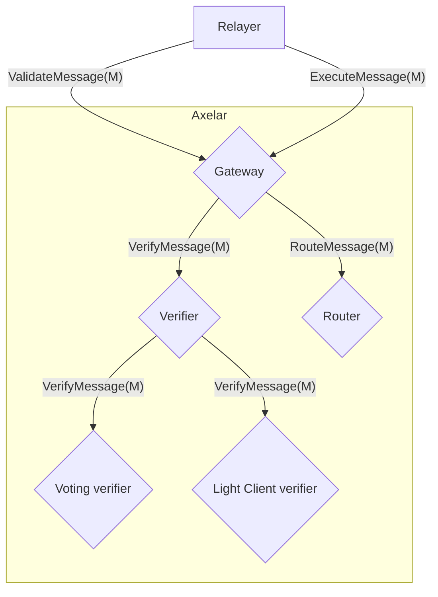
As an optimization `VerifyMessage(M)` can be replaced with `VerifyMessage(M.id, hash(M))`

# Event Flow

## Voting Contract Flows
ValidateMessage -> Poll -> ValidateMessage -> ExecuteMessage
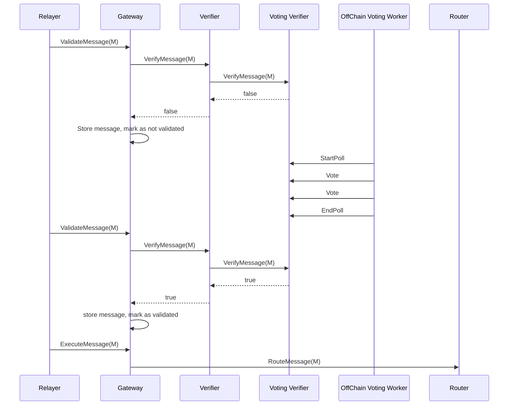
ValidateMessage -> Poll -> ExecuteMessage
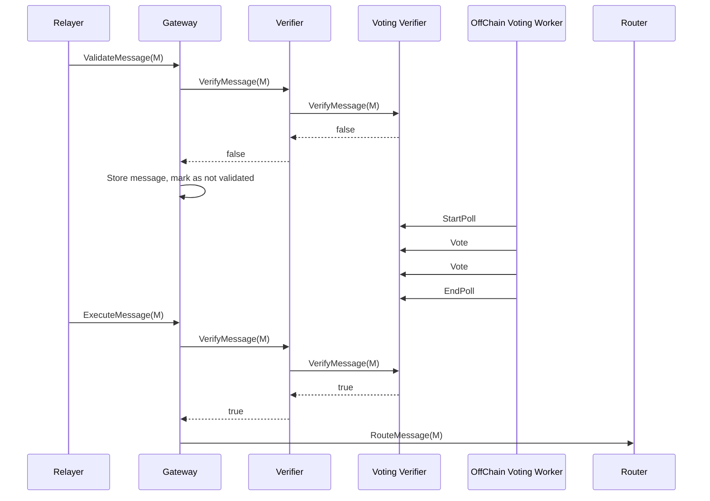
Poll -> ValidateMessage -> ExecuteMessage
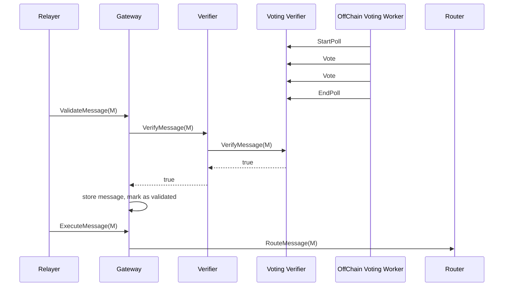
ExecuteMessage -> Poll -> ExecuteMessage
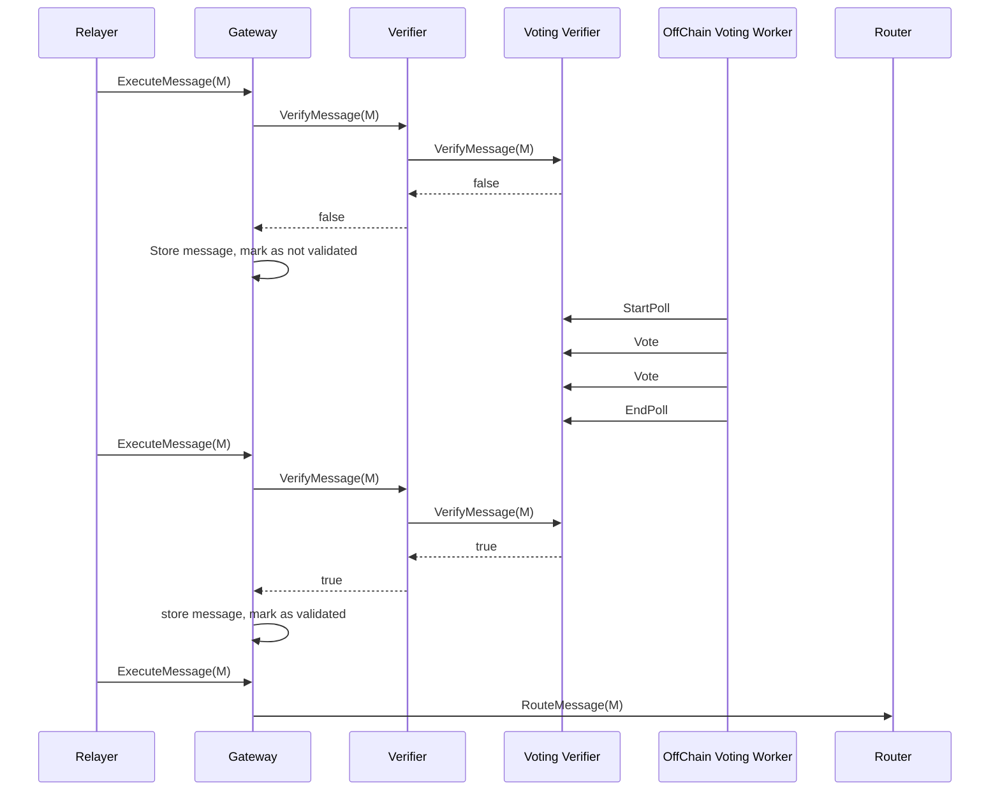

Poll -> ExecuteMessage
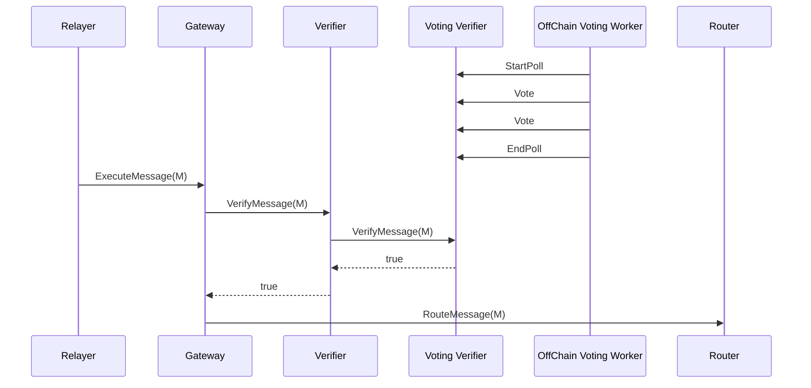

## Light client Flows


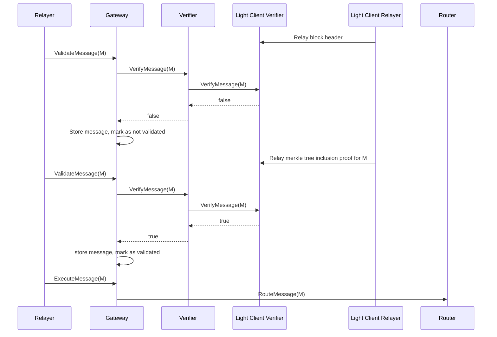


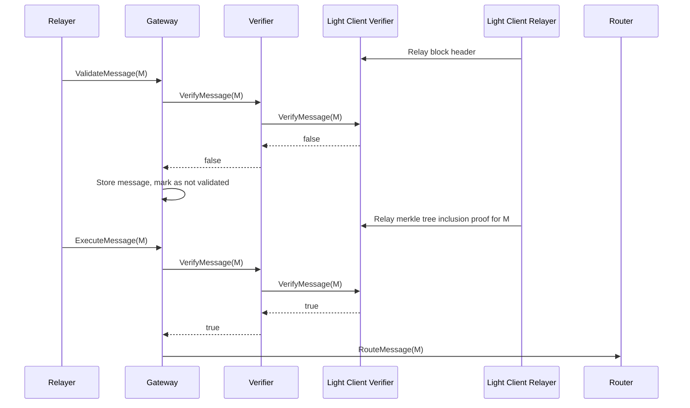

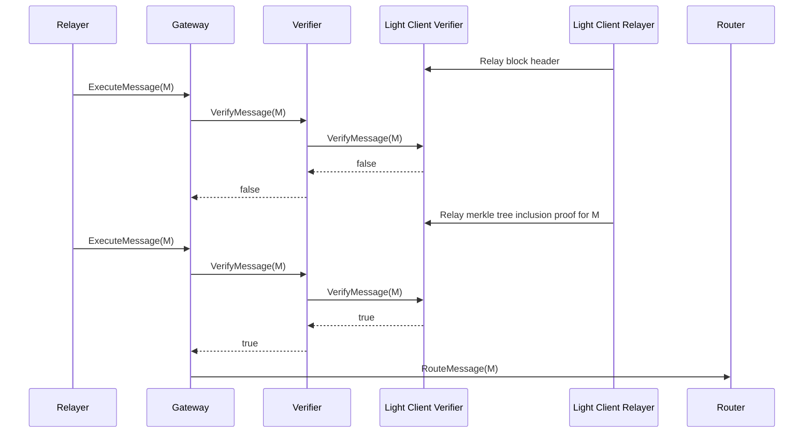

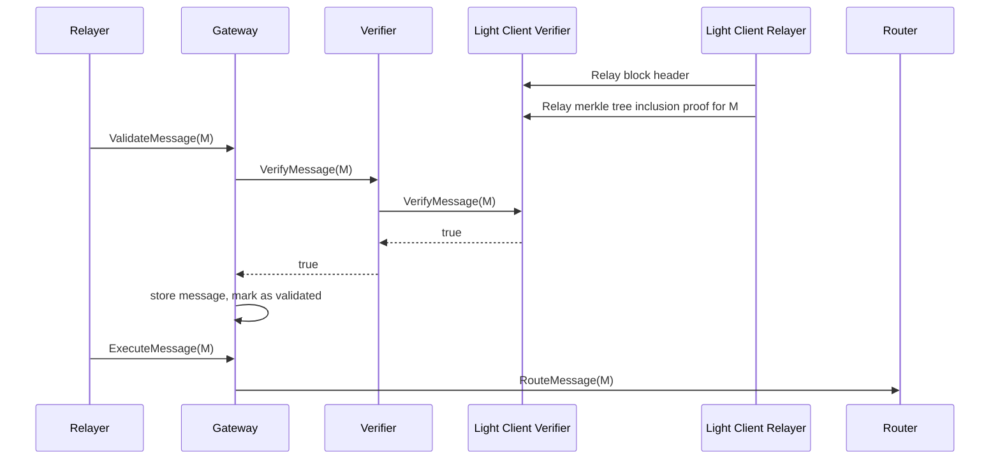


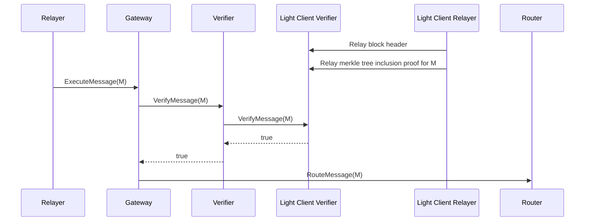


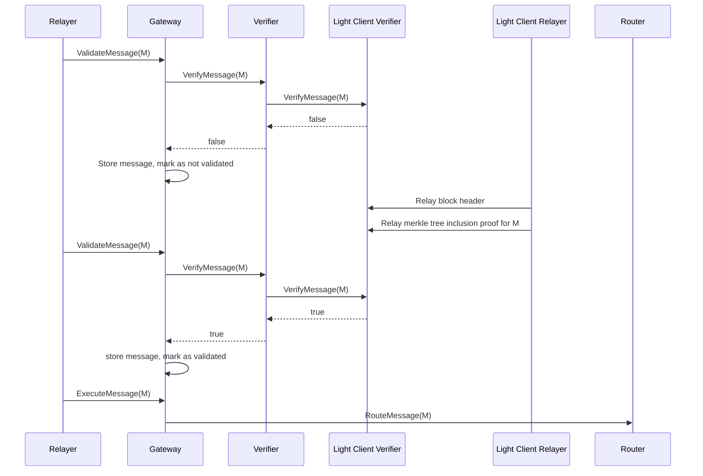
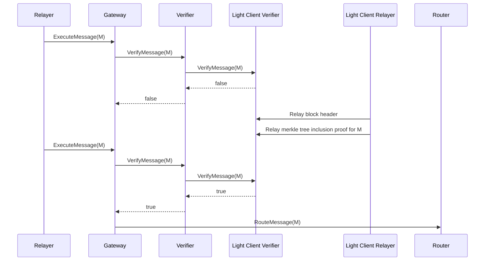

## Multiple validation methods
Assume the security policy is both light client and rpc voting validations are needed for a message to be considered fully validated.


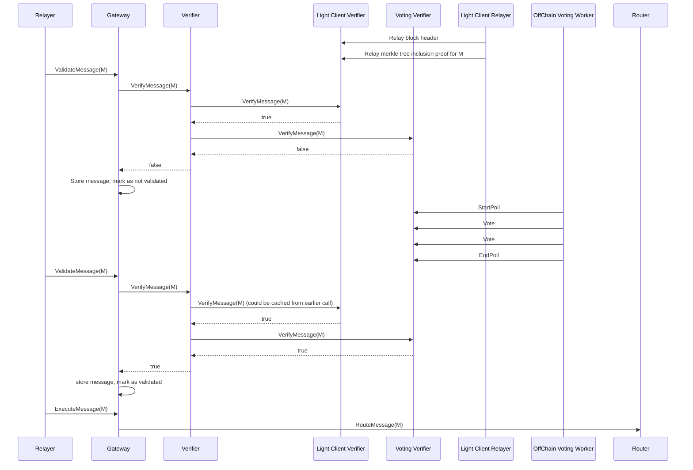


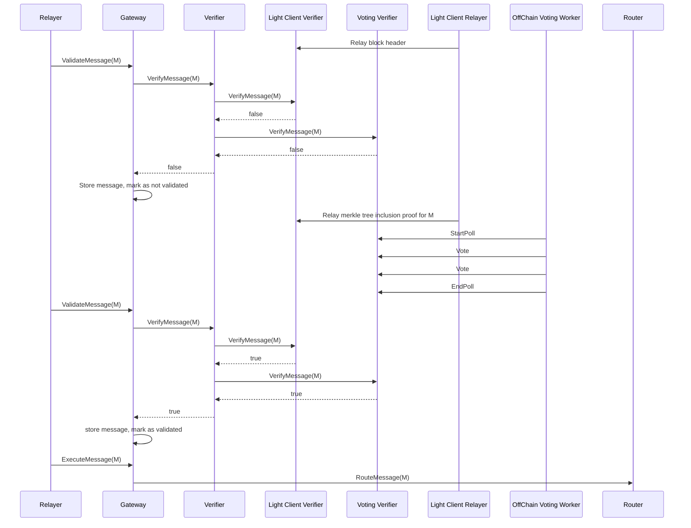


