# axelar-service-registry
# Message Semantics
Structure of a routing packet (`M` in the diagrams)
```rust
    struct Message {
        id: String,
        source_address: String,
        source_chain: String,
        destination_address: String,
        destination_chain: String,
        payload_hash: HexBinary
    }
```
# High Level Architecture
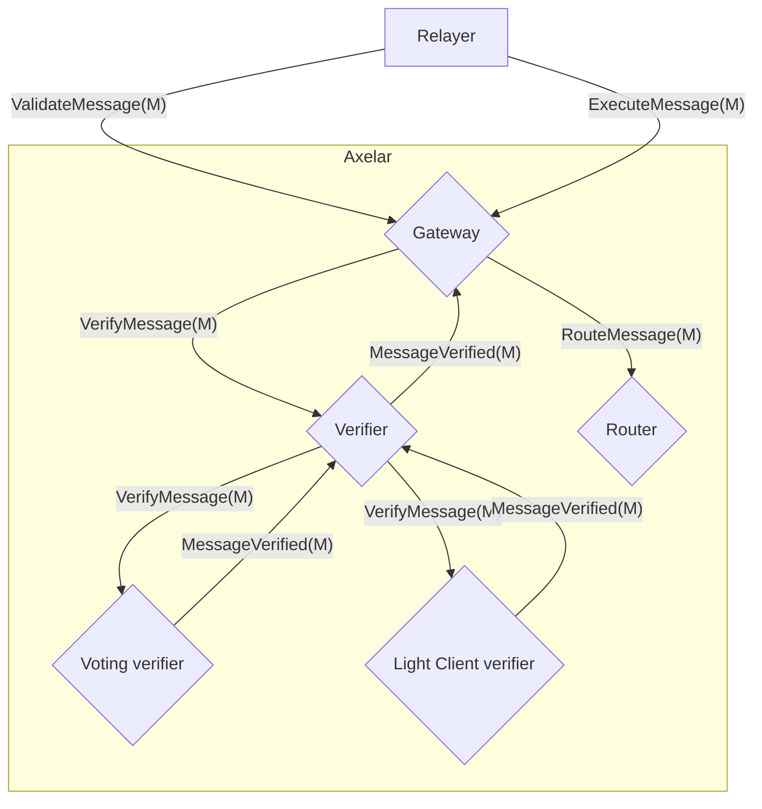
As an optimization `VerifyMessage(M)` can be replaced with `VerifyMessage(M.id, hash(M))`

# Event Flow

In all of the below flows, the specifics of how an individual verification method works (voting verifier or light client verifier)
is not important and is not part of this design. They are merely shown as examples. Each specific verification method 
just needs to accept `VerifyMessage` calls, and return true or false. Each specific verification method is free to
add additional methods and queries to its interface, to be called by associated worker processes or contracts (that could be on or off chain). 

In the below flows, the blue box represents the protocol. All messages flowing into, out of or within the blue box
are part of the protocol.

## Voting Contract Flows
ValidateMessage -> Poll -> ExecuteMessage
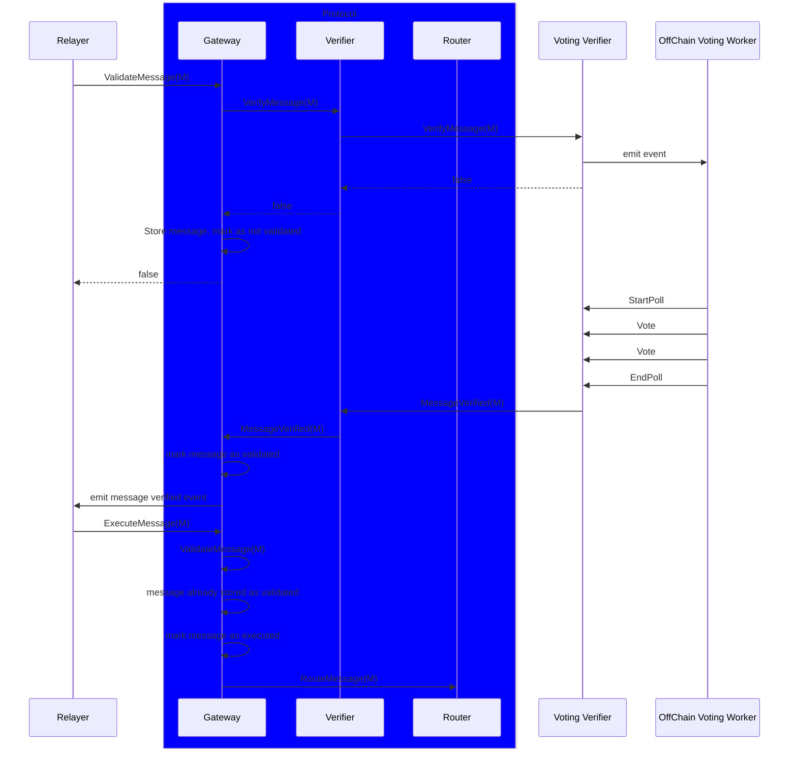

Poll -> ValidateMessage -> ExecuteMessage
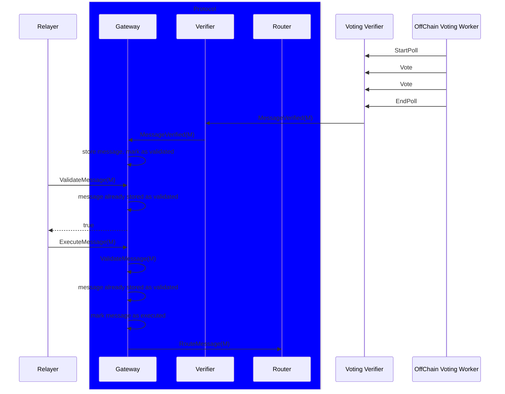
ExecuteMessage -> Poll -> ExecuteMessage
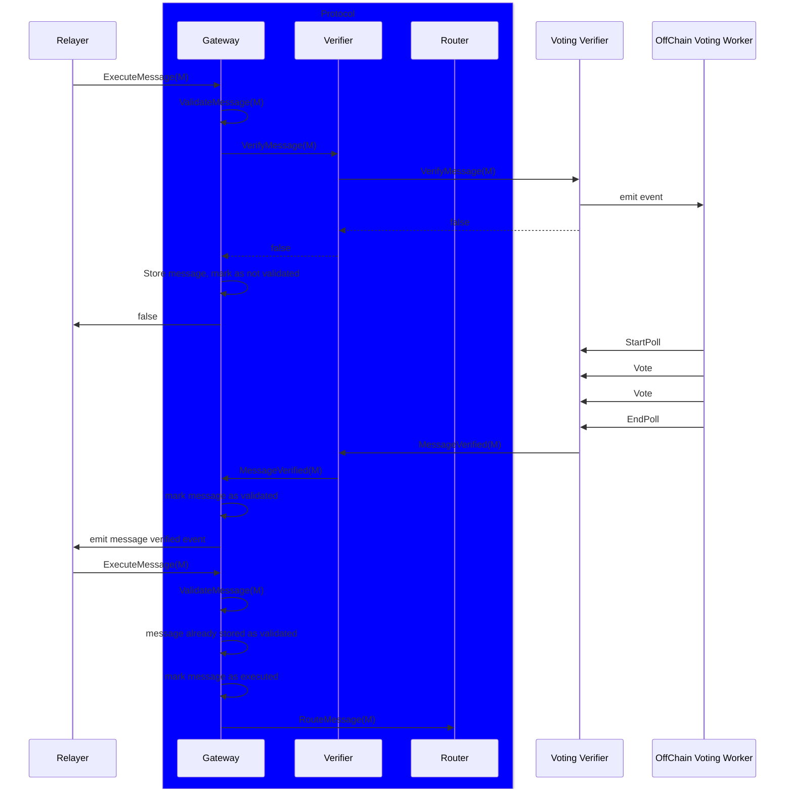

Poll -> ExecuteMessage
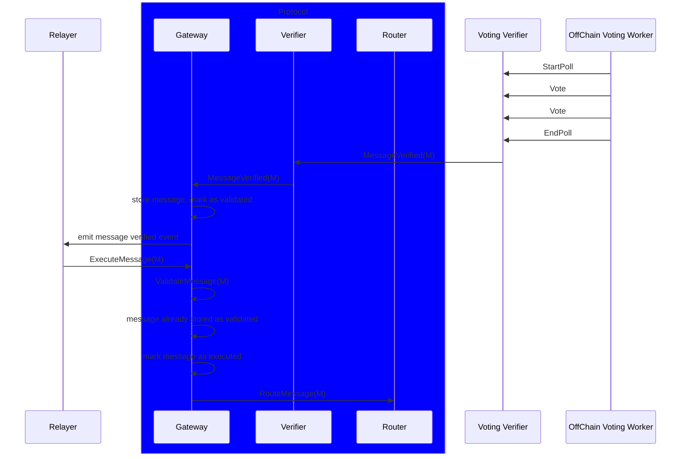

## Light client Flows


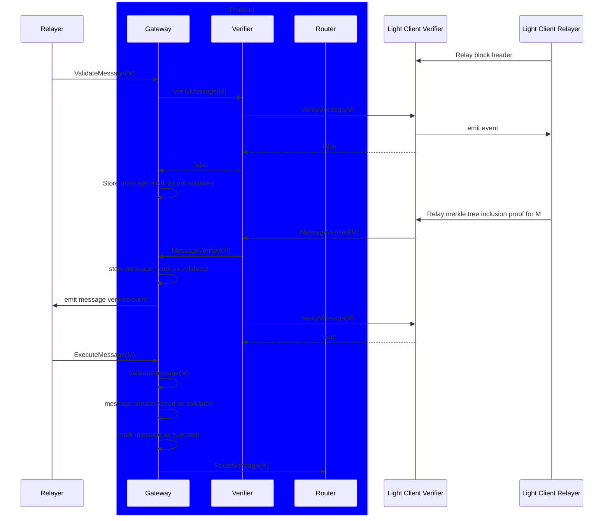

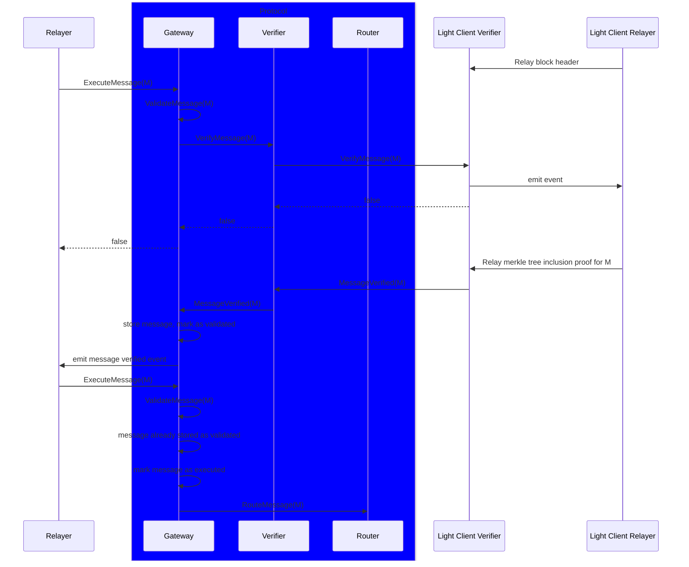

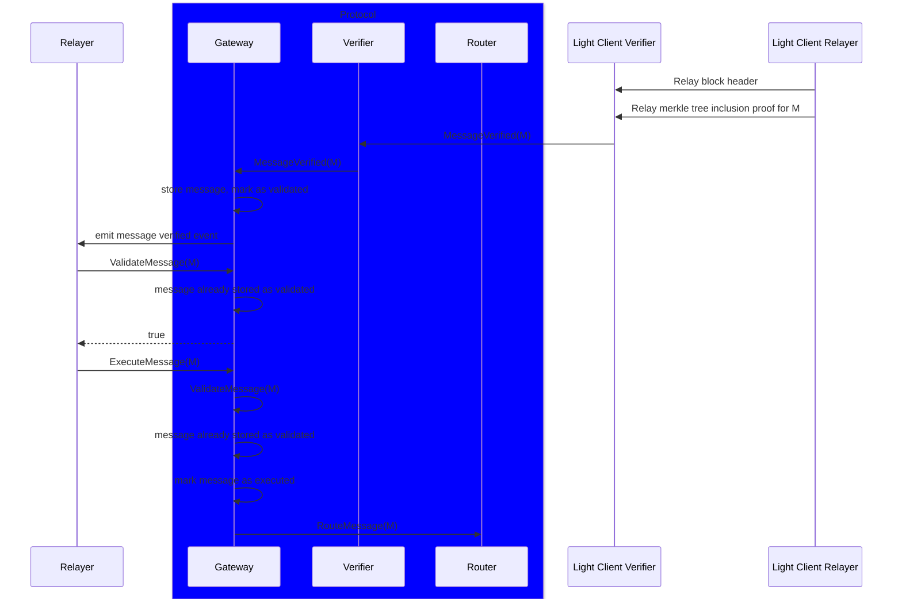


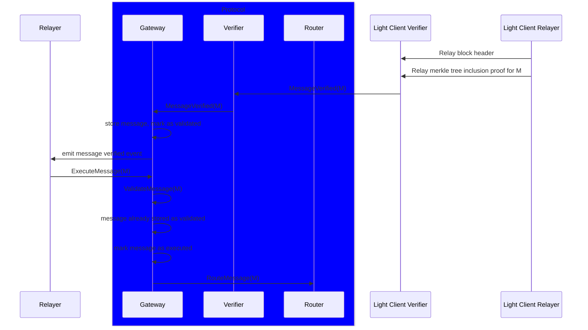


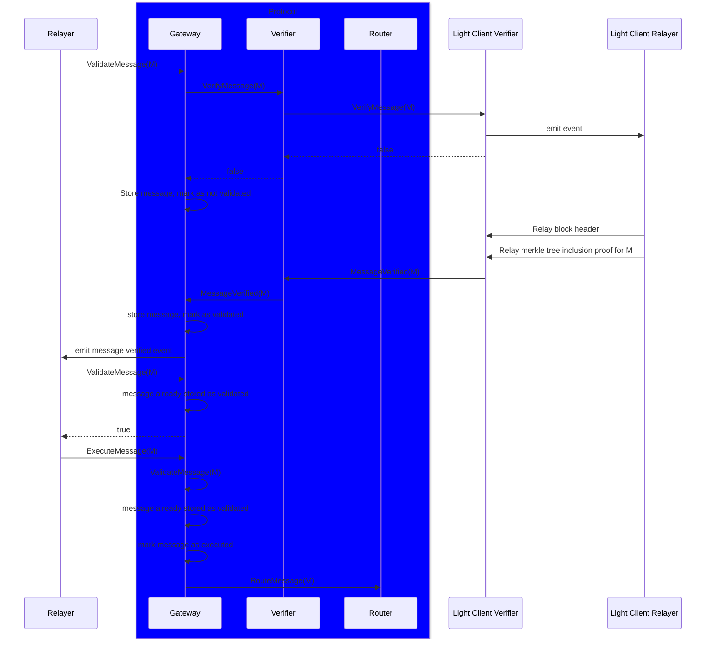


## Multiple validation methods
Assume the security policy is both light client and rpc voting validations are needed for a message to be considered fully validated.


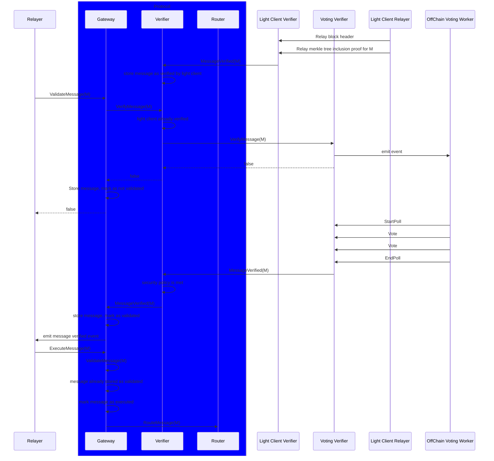


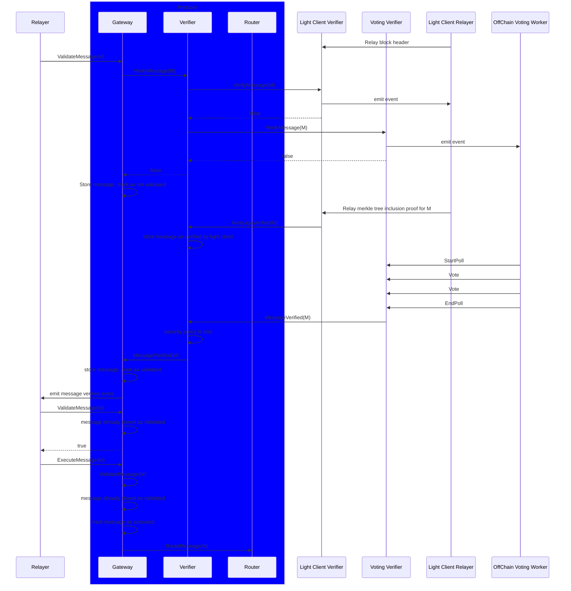


