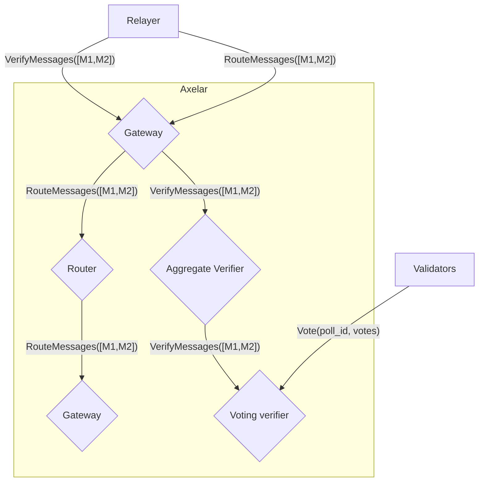
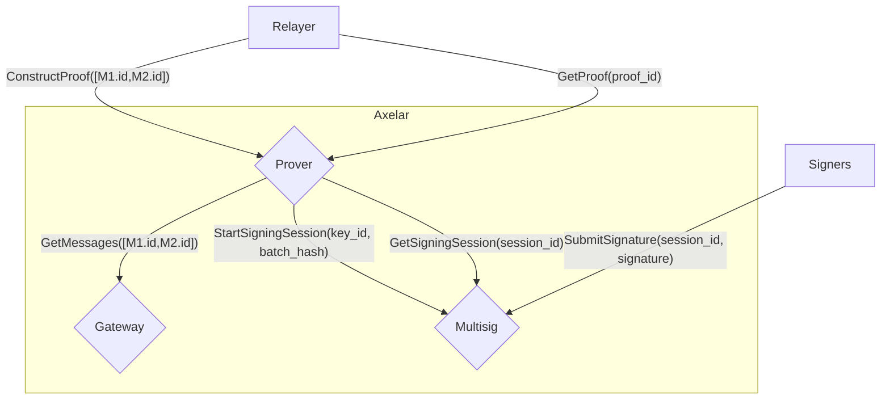

# axelar-service-registry
# Message Semantics
Structure of a routing packet (`M` in the diagrams)
```rust
    struct Message {
        id: String,
        source_address: String,
        source_chain: String,
        destination_address: String,
        destination_chain: String,
        payload_hash: HexBinary
    }
```
# High Level Architecture
Incoming Flow:

Outgoing Flow:


# Event Flow

In the below diagram, the blue box represents the protocol. All messages flowing into, out of or within the blue box
are part of the protocol. All components within the blue box are on chain. All components outside of the blue box are off chain.

## Voting Contract Flows
ValidateMessage -> Poll -> ExecuteMessage
```mermaid
sequenceDiagram
    participant Relayer
    box Blue Protocol
    participant IncomingGateway
    participant OutgoingGateway
    participant Router
    participant Verifier
    participant Prover
    participant Voting Verifier
    participant Multisig
    end
    participant OffChain Voting Worker
    participant Signer
    Relayer->>IncomingGateway: VerifyMessages([M1,M2])
    IncomingGateway->>Verifier: VerifyMessages([M1,M2])
    Verifier->>Voting Verifier: VerifyMessages([M1,M2])
    Voting Verifier->>OffChain Voting Worker: emit PollStarted
    Voting Verifier-->>Verifier: [(M1.id,false),(M2.id,false)]
    Verifier-->>IncomingGateway: [(M1.id,false),(M2.id, false)]
    IncomingGateway-->>Relayer: [(M1.id,false),(M2.id, false)]
    OffChain Voting Worker->>Voting Verifier: Vote
    OffChain Voting Worker->>Voting Verifier: Vote
    OffChain Voting Worker->>Voting Verifier: EndPoll


    Relayer->>IncomingGateway: RouteMessages([M1,M2])
    IncomingGateway->>Verifier: IsVerified([M1,M2])
    Verifier->>Voting Verifier: IsVerified([M1,M2])
    Voting Verifier->>Verifier: [(M1.id,true),(M2.id,true)]
    Verifier->>IncomingGateway: [(M1.id,true),(M2.id,true)]
    IncomingGateway->>Router: RouteMessages([M1,M2])
    Router->>OutgoingGateway: RouteMessages([M1,M2])
    Relayer->>Prover: ConstructProof([M1.id,M2.id])
    Prover->>Multisig: StartSigningSession(key_id, hash)
    Multisig-->>Prover: session_id
    Prover-->>Relayer: proof_id
    Signer->>Multisig: SubmitSignature(session_id, signature)
    Signer->>Multisig: SubmitSignature(session_id, signature)
    Relayer->>Prover: GetProof(proof_id)
    Prover->>Multisig: GetSigningSession(session_id)
    Prover-->>Relayer: proof

