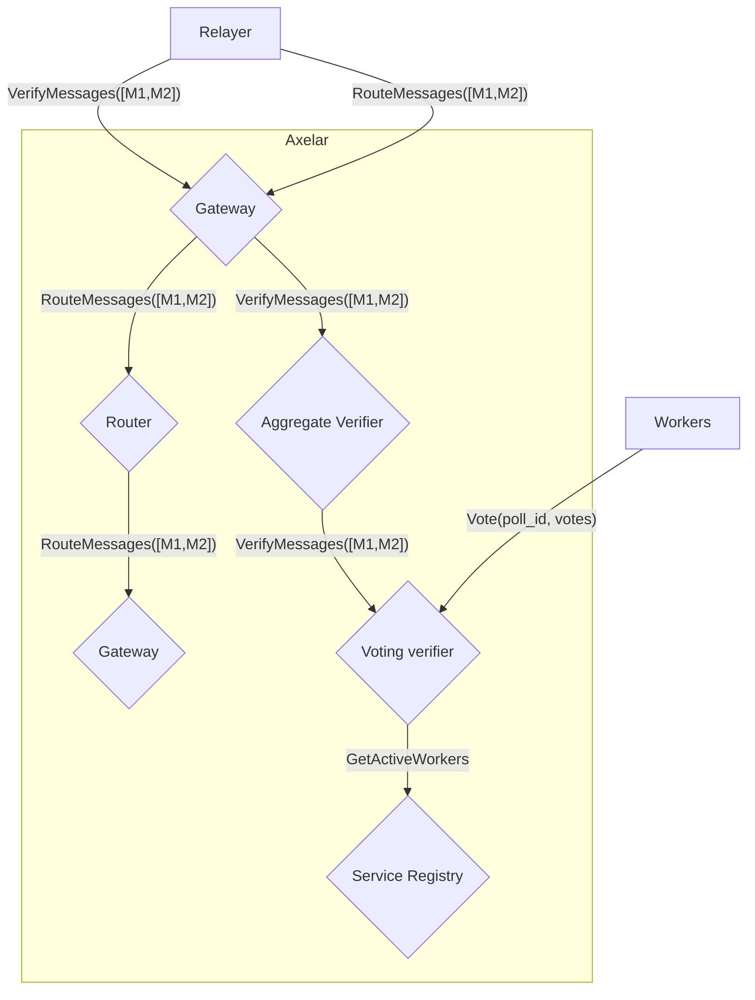

# Example

## Install

```bash
cargo install mdbook
cargo install mdbook-mermaid
cargo install mdbook-linkcheck
```

## Reference code with ANCHOR

```
// ANCHOR: events
```

```rust,no_run,no_playground
{{#include ../../contracts/multisig/src/events.rs:events}}
```

```
// ANCHOR_END: events
```

Note: [Include directives to missing files do not return error](https://github.com/rust-lang/mdBook/issues/1094)

## Mermaid diagram


