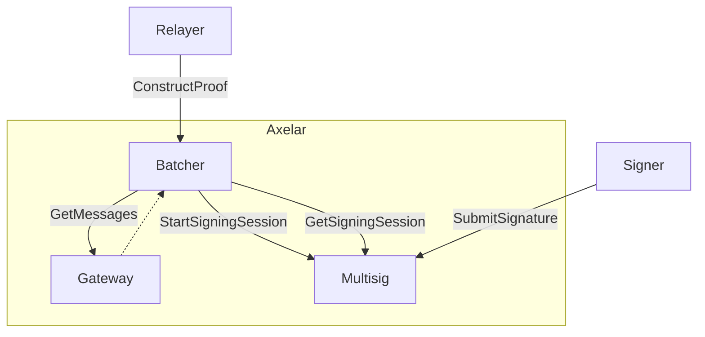
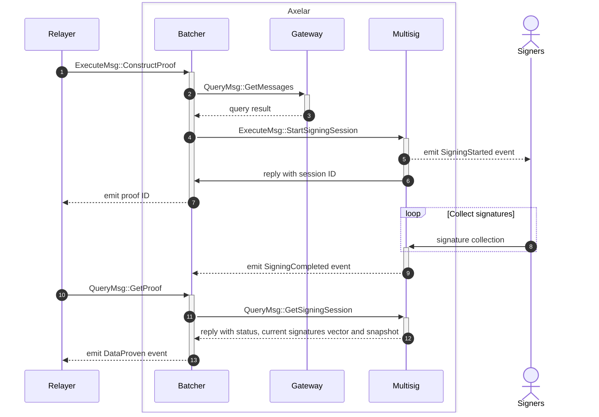

# Command batcher contract

The batcher contract is responsible for transforming gateway messages into a command batch that is ready to be sent to the destination gateway. It calls the multisig contract to generate the signature proof and finally encodes both the data and proof so that relayers can take it and send it to the destination chain gateway.



<br>
<br>

## Proof construction sequence diagram



1. Relayer asks Batcher contract to construct proof providing a list of messages IDs
2. If no batch for the given messages was previously created, it retrieves the messages from gateway to construct it
3. With the retrieved messages, the Batcher contract transforms them into a batch of commands and generates the binary message that needs to be signed by the multisig.
4. The Multisig contract is called asking to sign the binary message
5. Multisig emits event indicating a new multisig session has started
6. Multisig event returns the newly created session ID to the Batcher which is then stored with the batch for reference
7. Batcher contract emits event which includes the ID of the proof under construction.
8. Signers submit their signatures until threshold is reached
9. Multisig emits event indicating the multisig session has been completed
10. Relayer queries Batcher for the proof, using the proof ID
11. Batcher queries Multisig for the multisig session, using the session ID
12. Multisig replies with the multisig state, the list of collected signatures so far and the snapshot of participants.
13. If the Multisig state is `Completed`, the Batcher emits the `DataProven` event which includes the proof itself and the data to be sent to the destination gateway.

## Interface

```Rust
pub enum ExecuteMsg {
    // Start building a proof that includes specified messages
    // Queries the gateway for actual message contents
    ConstructProof {
        message_ids: Vec<String>,
    },
}
```

## Events

```Rust
// Emitted when the proof has been finalized
pub struct DataProven {
    pub proof_id: HexBinary, // Unique hash derived from the message ids
    pub message_ids: Vec<String>,
    pub data: Data,
    pub proof: Proof,
    pub execute_data: HexBinary, // encoded data and proof sent to destination gateway
}

pub struct Data {
    pub destination_chain_id: Uint256,
    pub commands_ids: Vec<[u8; 32]>,
    pub commands_types: Vec<String>,
    pub commands_params: Vec<HexBinary>
}

pub struct Proof {
    pub operators: Vec<Addr>,
    pub weights: Vec<Uint256>,
    pub threshold: Uint256,
    pub signatures: Vec<HexBinary>,
}
```
