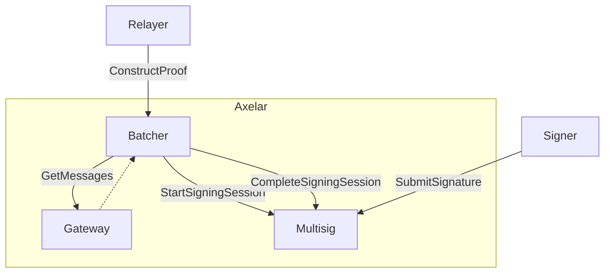
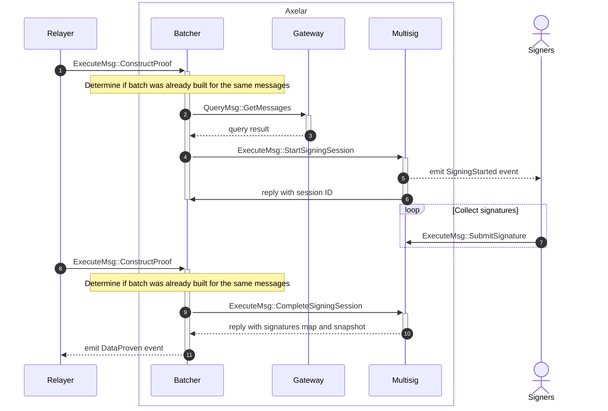

# Command batcher contract

The batcher contract is responsible for transforming gateway messages into a command batch that is ready to be sent to the destination gateway. It calls the multisig contract to generate the signature proof and finally encodes both the data and proof so that relayers can take it and send it to the destination chain gateway.



<br>
<br>

## Proof construction sequence diagram



1. Relayer asks Batcher contract to construct proof providing a list of messages IDs
2. If no previous batch was created for those messages, then the Batcher contract retrieves messages from gateway
3. With the retrieved messages, the Batcher contract transforms them into a batch of commands and generates the binary message that needs to be signed by the multisig.
4. The Multisig contract is called asking to sign the binary message
5. Multisig emits event indicating a new multisig session has started
6. Multisig event returns the newly created session ID to the Batcher which is then stored with the batch
7. Signers submit their signatures until threshold is reached
8. Relayer asks again the Batcher contract to construct the proof
9. Since a batch for the requested messages was already created and a signing session is associated, the Batcher contract asks the Multisig to complete the signing session if applicable
10. Multisig determines the conditions are met to finalize the signing session and if true, returns the list of collected signatures and the snapshot that was used during the multisig to determine valid participants
11. Batcher emits event that contains the data and the proof required to relay the messages to the destination chain

## Interface

```Rust
pub enum ExecuteMsg {
    // Start building a proof that includes specified messages
    // Queries the gateway for actual message contents
    ConstructProof {
        message_ids: Vec<String>,
    },
}
```

## Events

```Rust
// Emitted when the proof has been finalized
pub struct DataProven {
    pub proof_id: HexBinary, // Unique hash derived from the message ids
    pub message_ids: Vec<String>,
    pub data: Data,
    pub proof: Proof,
    pub execute_data: HexBinary, // encoded data and proof sent to destination gateway
}

pub struct Data {
    pub destination_chain_id: Uint256,
    pub commands_ids: Vec<[u8; 32]>,
    pub commands_types: Vec<String>,
    pub commands_params: Vec<HexBinary>
}

pub struct Proof {
    pub operators: Vec<Addr>,
    pub weights: Vec<Uint256>,
    pub threshold: Uint256,
    pub signatures: Vec<HexBinary>,
}
```
