# Aleo ITS-Hub and Axelar ITS-Hub message translation

# ITS HubMessage

ITS HubMesage defines 3 messages.

1. `SendToHub`
1. `ReceiveFromHub`
1. `RegisterTokenMetadata`

`SendToHub` and `ReceiveFromHub` define the direction of a message. They each wrap an ITS message along with the destination (for `SendToHub`) or the origin chain (for `ReceiveFromHub`), respectively.

# ITS Message

| Axelar ITS-Hub        | Direction | Aleo ITS-Hub                    |
| --------------------- | :-------: | ------------------------------- |
| InterchainTransfer    |    ->     | InboundInterchainTransfer      |
| InterchainTransfer    |    <-     | OutboundInterchainTransfer      |
| DeployInterchainToken |    ->     | FromRemoteDeployInterchainToken |
| DeployInterchainToken |    <-     | DeployInterchainToken           |
| LinkToken             |    <->    | TBD                             |

->: `ReceiveFromHub`
<-: `SendToHub`

# Aleo ITS Messages

| Axelar ITS-Hub                        | Aleo ITS-Hub                                                     |
| ------------------------------------- | ---------------------------------------------------------------- |
| SendToHub(InterchainTransfer)         | ItsInboundInterchainTransfer                                    |
| ReceiveFromHub(InterchainTransfer)    | ItsOutboundInterchainTransfer                                    |
| SendToHub(DeployInterchainToken)      | RemoteDeployInterchainToken(DeployInterchainToken)               |
| ReceiveFromHub(DeployInterchainToken) | ItsMessageDeployInterchainToken(FromRemoteDeployInterchainToken) |
| RegisterTokenMetadata                  | TBD                                                              |

```mermaid
flowchart LR
    subgraph EVM
        A[📤 SendToHub<br/>InterchainTransfer<br/>destination: Aleo]
        H[📥 ReceiveFromHub<br/>InterchainTransfer<br/>source: Aleo]
        L[🚀 SendToHub<br/>DeployInterchainToken<br/>destination: Aleo]
        M[📥 ReceiveFromHub<br/>DeployInterchainToken<br/>source: Aleo]
    end
    subgraph Aleo
        E[📥 ReceiveFromHub<br/>InboundInterchainTransfer<br/>source: EVM]
        G[📤 SendToHub<br/>ItsOutboundInterchainTransfer<br/>OutboundInterchainTransfer<br/>destination: EVM]
        N[📥 ReceiveFromHub<br/>ItsMessageDeployInterchainToken<br/>FromRemoteDeployInterchainToken<br/>source: EVM]
        O[🚀 SendToHub<br/>RemoteDeployInterchainToken<br/>DeployInterchainToken <br/>destination: EVM]
    end
    subgraph ITSHub
        C[🔄 TranslateFromAbiToHubMessage]
        F[⚙️ Hub Message<br/>Processing]
        D[🔄 TranslateFromHubMessageToAleo]
        I[🔄 TranslateFromAleoToHubMessage]
        J[⚙️ Hub Message<br/>Processing]
        K[🔄 TranslateFromHubMessageToAbi]
    end
    %% EVM to Aleo flow
    A --> C
    C --> F
    F --> D
    D --> E
    %% Aleo to EVM flow
    G --> I
    I --> J
    J --> K
    K --> H
    %% EVM DeployInterchainToken to Aleo flow
    L --> C
    D --> N
    %% Aleo DeployInterchainToken to EVM flow
    O --> I
    K --> M

    %% Improved color scheme
    style EVM fill:#f0f8ff,stroke:#4682b4,stroke-width:3px,color:#2c3e50
    style Aleo fill:#f5f0ff,stroke:#8b5cf6,stroke-width:3px,color:#2c3e50
    style ITSHub fill:#fafafa,stroke:#6b7280,stroke-width:3px,color:#2c3e50

    %% EVM nodes - blue theme
    style A fill:#dbeafe,stroke:#3b82f6,stroke-width:2px,color:#1e40af
    style H fill:#dbeafe,stroke:#3b82f6,stroke-width:2px,color:#1e40af
    style L fill:#bfdbfe,stroke:#2563eb,stroke-width:2px,color:#1d4ed8
    style M fill:#bfdbfe,stroke:#2563eb,stroke-width:2px,color:#1d4ed8

    %% Aleo nodes - purple theme
    style E fill:#e9d5ff,stroke:#8b5cf6,stroke-width:2px,color:#6b21a8
    style G fill:#e9d5ff,stroke:#8b5cf6,stroke-width:2px,color:#6b21a8
    style N fill:#ddd6fe,stroke:#7c3aed,stroke-width:2px,color:#5b21b6
    style O fill:#ddd6fe,stroke:#7c3aed,stroke-width:2px,color:#5b21b6

    %% Hub processing nodes - warm theme
    style C fill:#fef3c7,stroke:#f59e0b,stroke-width:2px,color:#92400e
    style D fill:#fef3c7,stroke:#f59e0b,stroke-width:2px,color:#92400e
    style I fill:#fef3c7,stroke:#f59e0b,stroke-width:2px,color:#92400e
    style K fill:#fef3c7,stroke:#f59e0b,stroke-width:2px,color:#92400e
    style F fill:#fed7aa,stroke:#ea580c,stroke-width:2px,color:#9a3412
    style J fill:#fed7aa,stroke:#ea580c,stroke-width:2px,color:#9a3412
```

