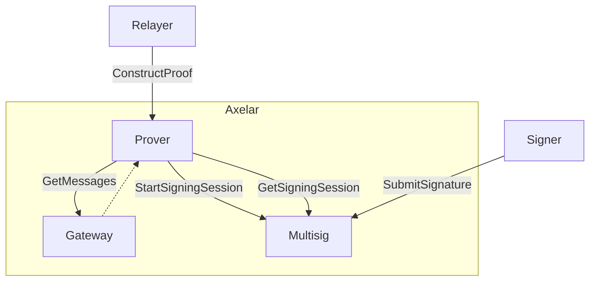
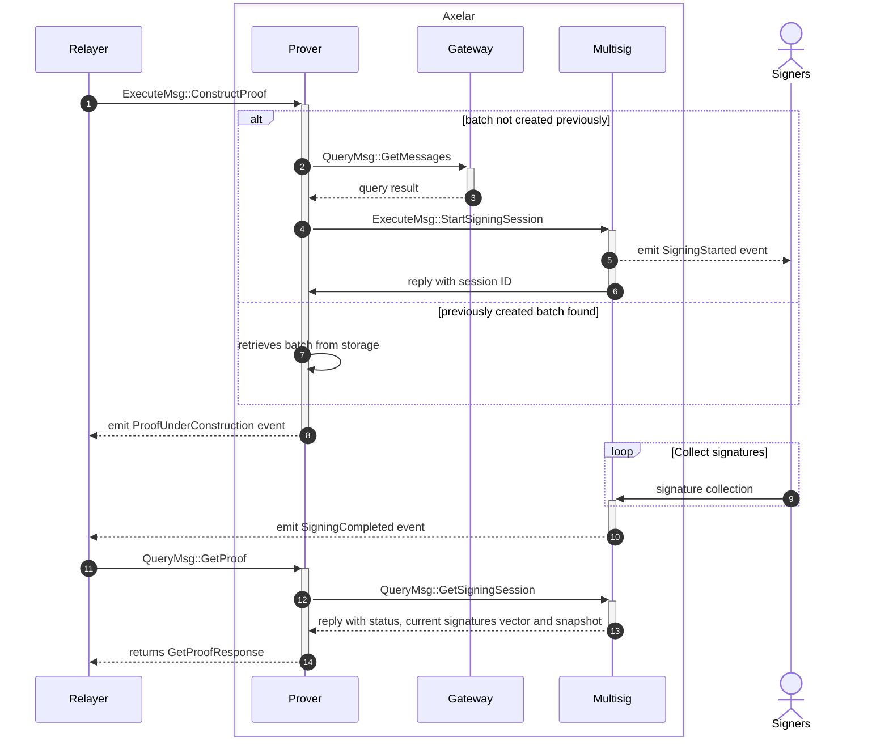

# Multisig prover contract

The prover contract is responsible for transforming gateway messages into a command batch that is ready to be sent to the destination gateway. It calls the multisig contract to generate the signature proof and finally encodes both the data and proof so that relayers can take it and send it to the destination chain gateway.



<br>
<br>

## Proof construction sequence diagram



1. Relayer asks Prover contract to construct proof providing a list of messages IDs
2. If no batch for the given messages was previously created, it queries the gateway for the messages to construct it
3. With the retrieved messages, the Prover contract transforms them into a batch of commands and generates the binary message that needs to be signed by the multisig.
4. The Multisig contract is called asking to sign the binary message
5. Multisig emits event indicating a new multisig session has started
6. Multisig triggers a reply in Prover returning the newly created session ID which is then stored with the batch for reference
7. If previous batch was found for the given messages IDs, the Prover retrieves it from storage instead of querying the gateway and build it again.
8. Prover contract emits event `ProofUnderConstruction` which includes the ID of the proof being constructed.
9. Signers submit their signatures until threshold is reached
10. Multisig emits event indicating the multisig session has been completed
11. Relayer queries Prover for the proof, using the proof ID
12. Prover queries Multisig for the multisig session, using the session ID
13. Multisig replies with the multisig state, the list of collected signatures so far and the snapshot of participants.
14. If the Multisig state is `Completed`, the Prover finalizes constructing the proof and returns the `GetProofResponse` struct which includes the proof itself and the data to be sent to the destination gateway. If the state is not completed, the Prover returns the `GetProofResponse` struct with the `status` field set to `Pending`.

## Interface

```Rust
pub enum ExecuteMsg {
    // Start building a proof that includes specified messages
    // Queries the gateway for actual message contents
    ConstructProof {
        message_ids: Vec<String>,
    },
}

#[derive(QueryResponses)]
pub enum QueryMsg {
    #[returns(GetProofResponse)]
    GetProof { proof_id: String },
}

pub enum ProofStatus {
    Pending,
    Completed { execute_data: HexBinary }, // encoded data and proof sent to destination gateway
}

pub struct GetProofResponse {
    pub proof_id: HexBinary,
    pub message_ids: Vec<String>,
    pub data: Data,
    pub proof: Proof,
    pub status: ProofStatus,
}

pub struct Data {
    pub destination_chain_id: Uint256,
    pub commands_ids: Vec<[u8; 32]>,
    pub commands_types: Vec<String>,
    pub commands_params: Vec<HexBinary>
}

pub struct Proof {
    pub operators: Vec<Addr>,
    pub weights: Vec<Uint256>,
    pub threshold: Uint256,
    pub signatures: Vec<HexBinary>,
}
```

## Events

```Rust
pub struct ProofUnderConstruction {
    pub proof_id: HexBinary, // Unique hash derived from the message ids
}
```
