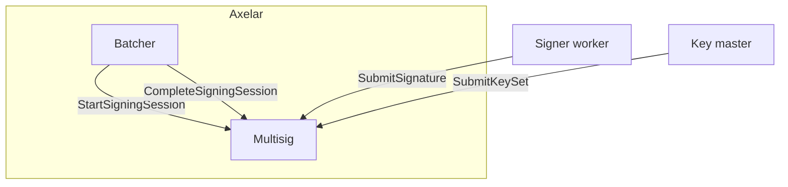
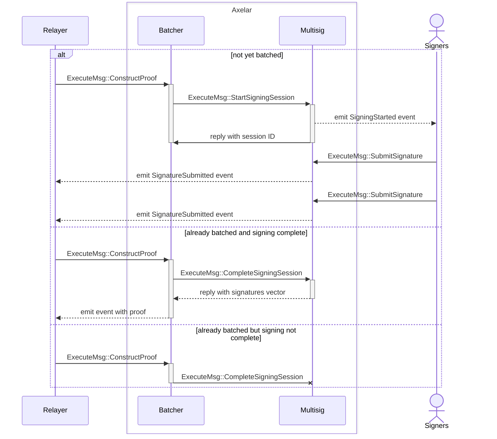

# Multisig contract

This contract is used by the batcher contract during proof construction to collect signatures from signers. For the purpose of this proof of concept, the initial design will not focus on key rotation. Instead, it will rely on a permissioned model where a "key master" will provide the keys that belong to each signer.



- **StartSigningSession**: The multisig contract receives a binary message from the batcher contract. It uses the current active set of keys to link to a new signing session and then emits an event to notify signers that a message is pending signature.
- **SubmitSignature**: Each signer will sign the message using their own private key and then submit the signature to the multisig contract. This process validates that the signer is a participant in the snapshot associated with the active key that was set for the multisig session.
- **CompleteSigningSession**: Called by the batcher contract to finalize a multisig session in case enough signatures were collected and returns the collected signatures.
- **SubmitKeySet**: Permissioned call by the “key master” to provide a new set of public keys for each signer. The multisig contract creates a snapshot that lists the participants with active stakes and filters out any keys that do not belong to a participant.

<br>

## Signing Sequence Diagram



## Interface

```Rust
pub enum ExecuteMsg {
    StartSigningSession {
        sig_msg: HexBinary,
    },
    SubmitSignature {
        multisig_session_id: Uint64,
        signature: HexBinary,
    },
    CompleteSigningSession {
        multisig_session_id: Uint64,
    },
    SubmitKeySet {
        pub_keys: HashMap<String, HexBinary>,
    },
}
```

## Events

```Rust
// Emitted when a new signing session is open
pub struct SigningStarted {
    pub multisig_session_id: Uint64,
    pub key_set_id: Uint64,
    pub pub_keys: HashMap<String, HexBinary>,
    pub sig_msg: HexBinary,
}

// Emitted when a participants submits a signature
pub struct SignatureSubmitted {
    pub multisig_session_id: Uint64,
    pub participant: Addr,
    pub signature: HexBinary,
}

// Emitted when a signing session was completed
pub struct SigningCompleted {
    pub multisig_session_id: Uint64,
}
```
