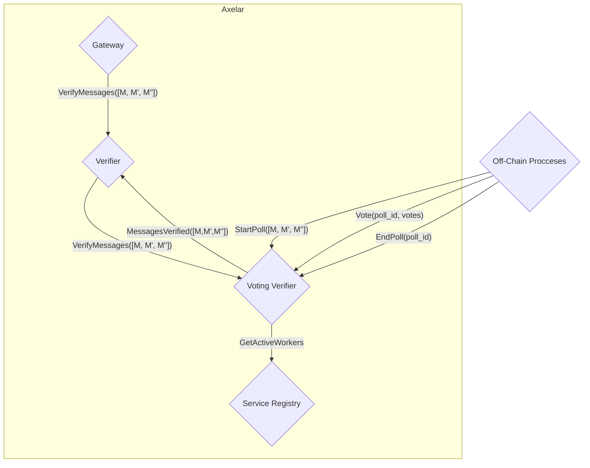
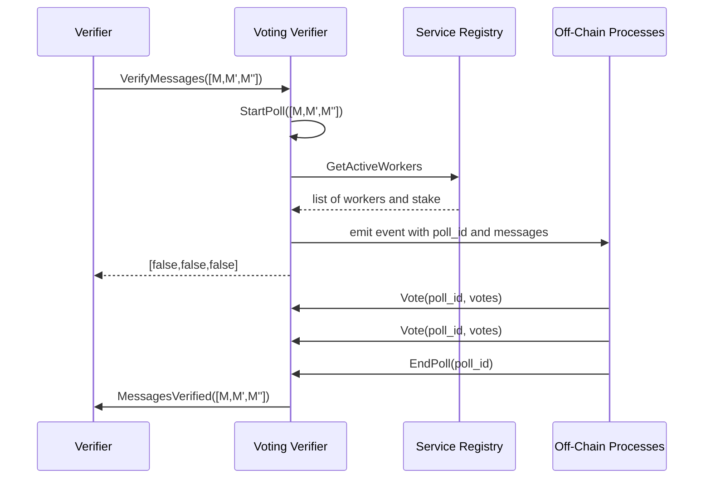

# Voting Verifier

The voting verifier verifies batches of messages via RPC voting. Polls are created and votes are cast via a generic voting module,
which the voting verifier uses. The generic voting module does not know the meaning of the polls, and simply returns a poll
poll ID to the voting verifier. The voting verifier internally maps
a poll ID to the messages in the poll, to be able to call back to
the verifier and propagate the result back to the gateway.

