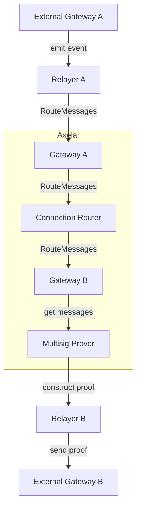
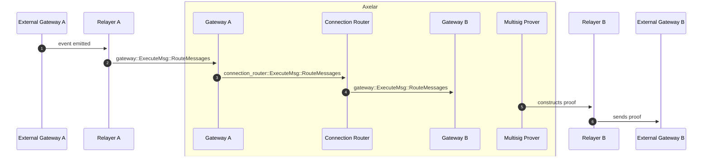

# Connection Router Contract

The connection router contract is responsible for routing messages to and from registered gateways, as well as handling chain registration, gateway upgrades and chain freezing.
<br>
The router admin can freeze and unfreeze a chain for a specified direction, while governance can register a chain and upgrade its gateway.

## Interface

```Rust
pub enum ExecuteMsg {
    /*
     * Governance Methods
     * All of the below messages can only be called by governance
     */
    // Registers a new chain with the router
    RegisterChain {
        chain: ChainName,
        gateway_address: String,
    },
    // Changes the gateway address associated with a particular chain
    UpgradeGateway {
        chain: ChainName,
        contract_address: String,
    },

    /*
     * Router Admin Methods
     * All of the below messages can only be called by the router admin
     */
    // Freezes a chain, in the specified direction.
    FreezeChain {
        chain: ChainName,
        direction: GatewayDirection,
    },
    // Unfreezes a chain, in the specified direction.
    UnfreezeChain {
        chain: ChainName,
        direction: GatewayDirection,
    },

    /*
     * Gateway Messages
     * The below messages can only be called by registered gateways
     */
    // Routes each message to the gateway registered to the destination chain.
    // Called by a registered gateway
    RouteMessages(Vec<Message>),
}

pub struct RouterInstantiated {
    pub admin: Addr,
    pub governance: Addr,
    pub nexus_gateway: Addr,
}

pub struct ChainRegistered {
    pub name: ChainName,
    pub gateway: Addr,
}

pub struct GatewayInfo {
    pub chain: ChainName,
    pub gateway_address: Addr,
}

pub struct GatewayUpgraded {
    pub gateway: GatewayInfo,
}

pub struct GatewayFrozen {
    pub gateway: GatewayInfo,
}

pub struct GatewayUnfrozen {
    pub gateway: GatewayInfo,
}

pub struct ChainFrozen {
    pub name: ChainName,
}

pub struct ChainUnfrozen {
    pub name: ChainName,
}

pub struct MessageRouted {
    pub msg: Message,
}
```


## Connection Router graph



## Message Routing sequence diagram



1. The External Gateway emits an event that is picked up by the Relayer.
2. Relayer relays the event to the Gateway as a message.
3. Gateway receives the incoming messages, verifies the messages, and then passes the messages to the Connection Router.
4. Connection router sends the outgoing messages from Gateway A to Gateway B, which is the representation of destination chain on Axelar chain.
5. The Multisig Prover takes the messages stored in the destination Gateway and constructs a proof.
6. The Relayer sends the proof, which also contains messages, to the destination's External Gateway.

### Notes
1. External Gateways are deployed on blockchains other than Axelar, such as Ethereum and Avalanche, while internal gateways reside on Axelar's chain.
