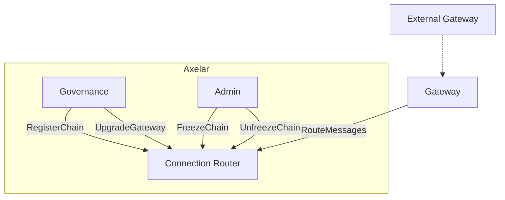
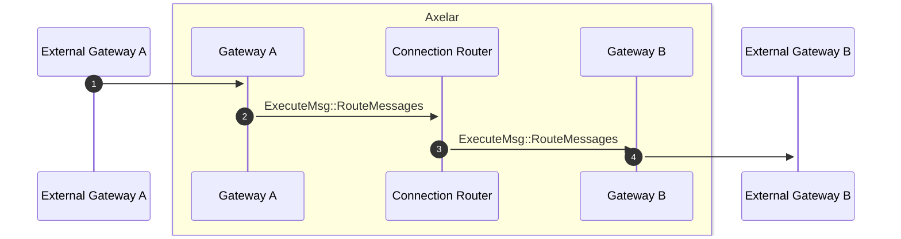

# Connection Router Contract

The connection router contract is responsible for routing messages to and from registered gateways, as well as handling chain registration, gateway upgrades and chain freezing.

## Interface

```Rust
pub enum ExecuteMsg {
    /*
     * Governance Methods
     * All of the below messages can only be called by governance
     */
    // Registers a new chain with the router
    RegisterChain {
        chain: ChainName,
        gateway_address: String,
    },
    // Changes the gateway address associated with a particular chain
    UpgradeGateway {
        chain: ChainName,
        contract_address: String,
    },

    /*
     * Router Admin Methods
     * All of the below messages can only be called by the router admin
     */
    // Freezes a chain, in the specified direction.
    FreezeChain {
        chain: ChainName,
        direction: GatewayDirection,
    },
    // Unfreezes a chain, in the specified direction.
    UnfreezeChain {
        chain: ChainName,
        direction: GatewayDirection,
    },

    /*
     * Gateway Messages
     * The below messages can only be called by registered gateways
     */
    // Routes a message to all outgoing gateways registered to the destination domain.
    // Called by a registered gateway
    RouteMessages(Vec<Message>),
}

#[derive(QueryResponses)]
pub enum QueryMsg {}
```

## Events

```Rust
pub struct RouterInstantiated {
    pub admin: Addr,
    pub governance: Addr,
    pub nexus_gateway: Addr,
}

pub struct ChainRegistered {
    pub name: ChainName,
    pub gateway: Addr,
}

pub struct GatewayInfo {
    pub chain: ChainName,
    pub gateway_address: Addr,
}

pub struct GatewayUpgraded {
    pub gateway: GatewayInfo,
}

pub struct GatewayFrozen {
    pub gateway: GatewayInfo,
}

pub struct GatewayUnfrozen {
    pub gateway: GatewayInfo,
}

pub struct ChainFrozen {
    pub name: ChainName,
}

pub struct ChainUnfrozen {
    pub name: ChainName,
}

pub struct MessageRouted {
    pub msg: Message,
}
```

## Connection Router graph



## Message Routing sequence diagram



1. The External Gateway sends an incoming message to Gateway
2. Gateway receives the incoming messages, verifies the messages, and then passes the messages to the Connection Router to route them to the destination Gateway.
3. The Connection Router sends outgoing messages to the destination Gateways.
4. The destination Gateway emits a MessageRouted event, and the message goes to the destination's External Gateway