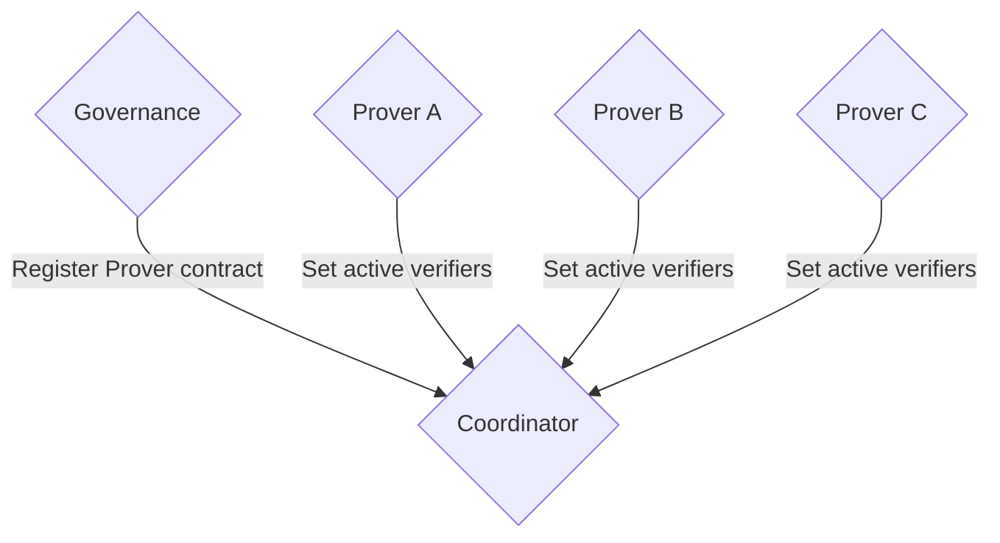
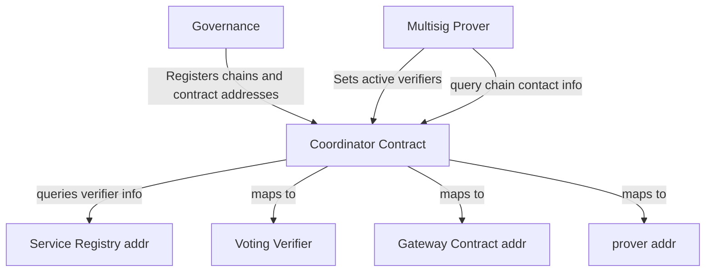

# Coordinator

Some contracts, like the multisig provers, are deployed per chain and unknown to one another.The Coordinator Contract is like a central registry for mapping and coordinating relationships between those chain-specific contracts in the Axelar Amplifier system. 
The coordinator contract keeps track of these chain-dependent provers and coordinates any interaction that requires knowledge of all of them. 
For example, the ability for a verifier to unbond their stake requires to check that it's not part of any active verifier set on any chain.

### Prover Registration and Verifier Management

The Coordinator Contract acts as a central hub that registers chain-specific prover contracts, manages active verifiers, and routes queries between governance, provers, and other components like the service registry and gateway.

