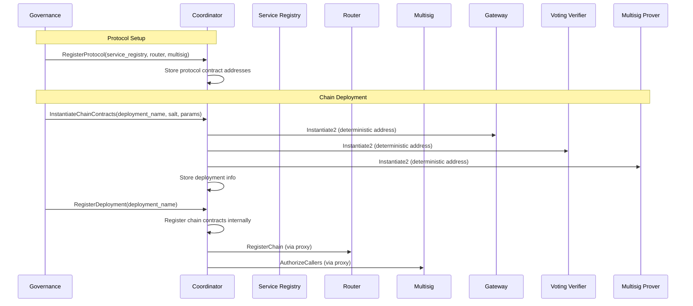

# Coordinator

The coordinator contract serves as the central registry and orchestrator for chain-specific contract deployments. It is also used by the service registry to determine whether or not a verifier is able to unbond.

## Overview

Each blockchain the amplifier suppors requires its own set of contracts (gateway, voting verifier, and multisig prover). The coordinator contract:

1. **Orchestrates Instantiation**: Can instantiate complete chain contract sets using INSTANTIATE2 for deterministic addresses
1. **Manages Chain Deployments**: Registers and tracks chain-specific contract deployments
1. **Coordinates Active Verifier Sets**: Allows provers to update their active verifier sets and query verifier status across chains
1. **Enables Safe Unbonding**: Verifies whether verifiers can safely unbond by checking if they're active on any chain

We split 

## Key Features

### Contract Instantiation & Registration

The coordinator can instantiate a complete set of contracts for a new chain deployment:
- Gateway contract (receives and routes cross-chain messages)
- Voting verifier contract (verifies messages through verifier consensus)
- Multisig prover contract (generates multisig proofs for the chain)

After instantiation, deployments can be registered with the router and multisig contracts to activate them in the protocol.

### Multi-Index Querying

Chain contracts can be queried by:
- Chain name
- Prover contract address
- Gateway contract address
- Verifier contract address

This enables efficient lookups regardless of which identifier is known.

### Verifier Set Tracking

The coordinator maintains active verifier sets for each chain, enabling:
- Multisig provers to update their active verifier lists
- Queries to check if a verifier is actively signing for any chain
- Safe unbonding verification (ensuring verifiers aren't active on any chain before unbonding)

## Execute Messages

| Message | Permission | Description |
|---------|-----------|-------------|
| `RegisterProtocol` | Governance | Register core protocol contracts (service registry, router, multisig) |
| `RegisterChain` | Governance | Register existing chain-specific contracts |
| `SetActiveVerifiers` | Any Multisig Prover | Update the active verifier set for the calling prover |
| `InstantiateChainContracts` | Governance | Instantiate a complete set of chain contracts with deterministic addresses |
| `RegisterDeployment` | Governance | Register an instantiated deployment with the router and multisig |

## Query Messages

| Query | Returns | Description |
|-------|---------|-------------|
| `ReadyToUnbond` | `bool` | Check if a verifier can safely unbond (not in any active set) |
| `VerifierInfo` | `VerifierInfo` | Get verifier details including which chains they're signing for |
| `ChainContractsInfo` | `ChainContractsResponse` | Query chain contracts by name, prover, gateway, or verifier address |
| `Deployments` | `Vec<ChainContractsResponse>` | List all deployments with pagination |
| `Deployment` | `ChainContractsResponse` | Get details of a specific deployment by deployment name |
| `Instantiate2Address` | `Addr` | Calculate the address that would result from an instantiate2 operation |

## Usage Flow

We split usage into three stepss: protocol contract initialization, contract instantiation, and chain deployment. The router and multisig contracts require the coordinator's address when being instantiated. To avoid having to predict these addresses in advance, we first instantiate the coordinator, and only afterward provide the router and multisig addresses back to it. The service registry address is also given for convenience. Additionally, we keep contract instantiation and deployment as separate steps so that chain operators have the chance to review and adjust contract parameters before the contracts are fully integrated into the protocol.

