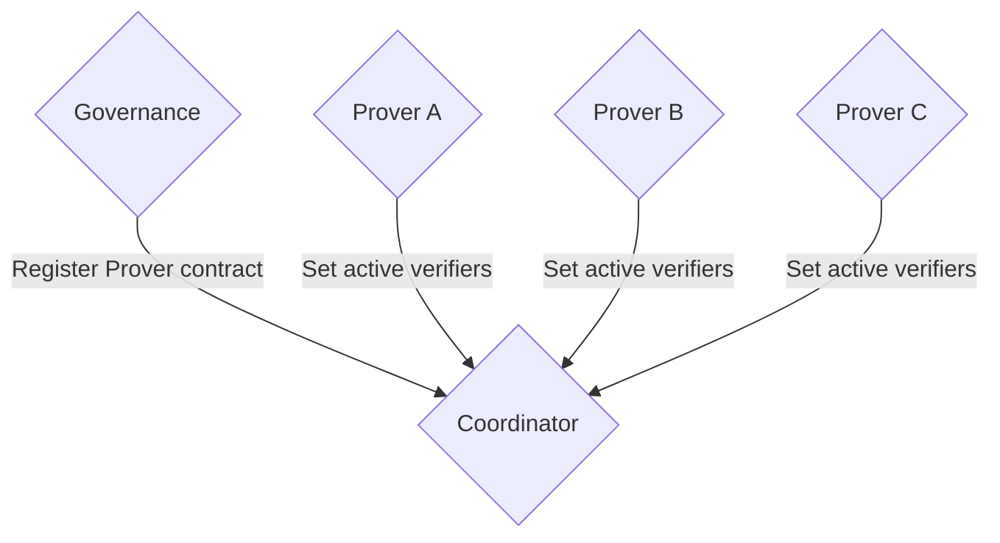

# Coordinator

Some contracts, like the multisig provers, are deployed per chain and unknown to one another. The coordinator contract keeps track of these chain-dependent provers and coordinates any interaction that requires knowledge of all of them. For example, the ability for a verifier to unbond their stake requires to check that it's not part of any active verifier set on any chain.

