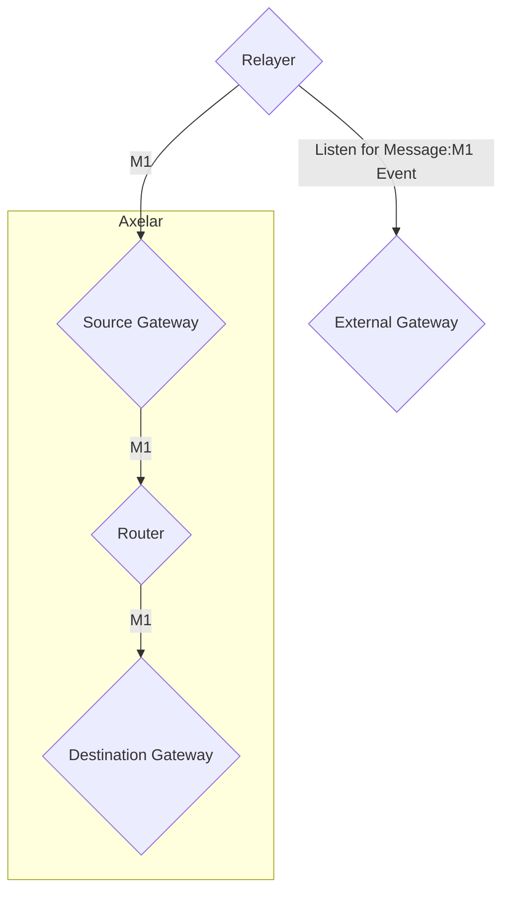

# Gateway

The name `gateway` used in this documentation refers to those entities which reside
on axelar chain, which can also be called internal gateways. On the other hand we have
external gateways, which are gateways deployed on external chains connected to Axelar.

The gateway contract is how messages enter the amplifier protocol.
Here are the steps taken throughout the lifecycle of
a message:
1. User sends a message to the external gateway. We call this incoming message.
2. Incoming messages are sent to the gateway via `VerifyMessages`.
3. The gateway calls `VerifyMessages` on the verifier, which submits the messages for verification (or just returns true if already verified).
4. The messages are verified asynchronously, and the verification status is stored in the verifier.
5. Once the messages are verified, `RouteMessages` is called at the gateway, which forwards the verified messages to the router.
6. The router forwards each message to the gateway registered to the destination chain specified in the message.
7. The prover retrieves the messages from the gateway, organizes them into a payload and submits the payload for signing.
8. The relayer sends the signed payload to the external gateway.


## Gateway graph



## Interface

```Rust
pub struct InstantiateMsg {
    pub verifier_address: String,
    pub router_address: String,
}
```

As you can see, the gateway only needs to know the address of the two contracts it
works with, which are voting verifier and router.
