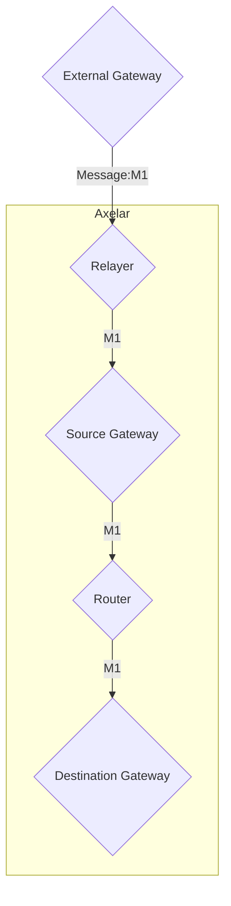

# Gateway

The name `gateway` used in this documentation refers to those entities which reside
on axelar chain, which can also be called internal gateways. On the other hand we have
external gateways, which are on the external chains that axelar supports. 

Gateway is how messages enter amplifier. Here are the steps taken throughout the lifecycle of 
a message:
1. Incoming messages are directed to the gateway.
2. The gateway sends the messages to the verifier for verification.
3. The verifier confirms the verification status back to the gateway.
4. Upon verification, the gateway forwards the messages to the router.
5. The router then transfers the messages to the gateway of other chains.
6. The prover retrieves the messages from the gateway and organizes them into a batch.
7. The relayer picks up the batch for further processing.


## Gateway graph



## Interface

```Rust
pub struct InstantiateMsg {
    pub verifier_address: String,
    pub router_address: String,
}
```

As you can see, the gateway only needs to know the address of the two contracts it
works with, which are voting verifier and router.