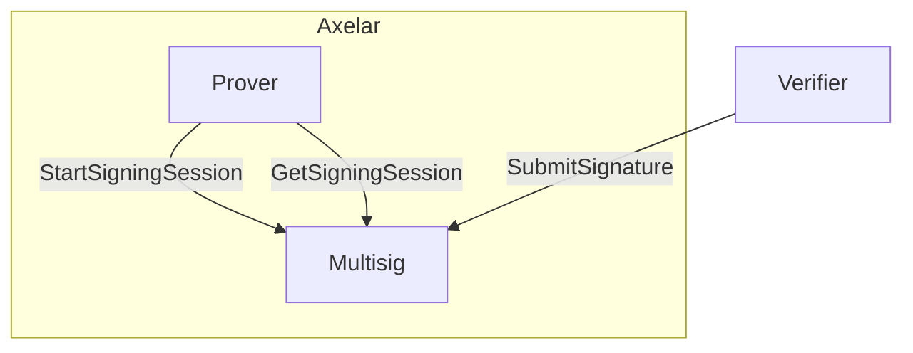
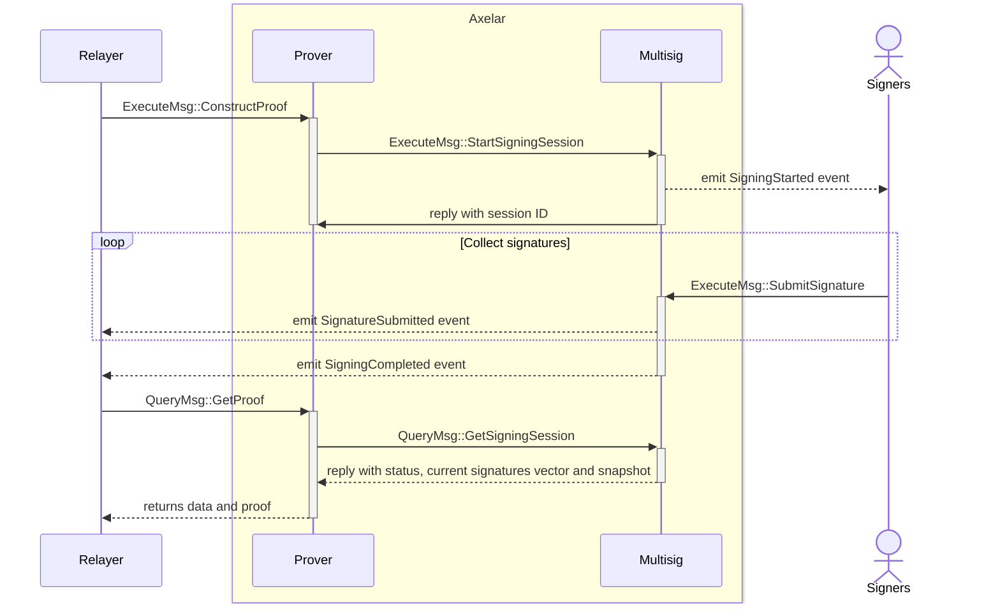
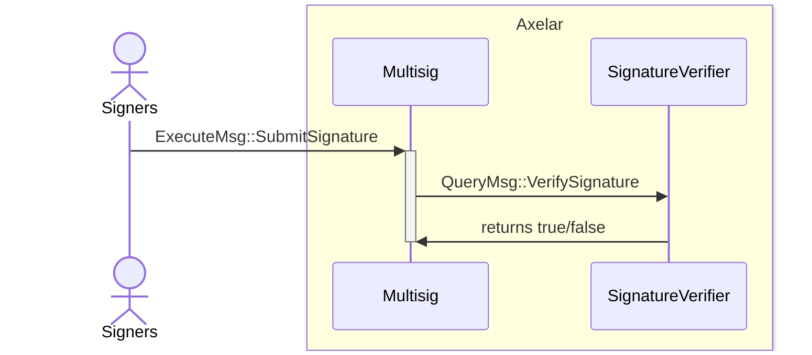

# Multisig contract

This contract is used by the prover contract during proof construction to start a signing session and collect signatures
from participants.



- **StartSigningSession**: The multisig contract receives a binary message from the prover contract. It uses the current
  active set of keys to link to a new signing session and then emits an event to notify signers that a message is
  pending signature.
- **SubmitSignature**: Each signer will sign the message using their own private key and then submit the signature to
  the multisig contract. This process validates that the signer is a participant in the snapshot associated with the
  active key that was set for the multisig session.
- **GetSigningSession**: Query called by the prover contract to retrieve the current state of the session, collected
  signatures so far and the snapshot with participants information. The proof is generated by the prover contract if the
  multisig was completed.

<br>

## Signing Sequence Diagram



## Custom signature verification

If the multisig contract doesn't natively support the required signature verification, the `sig_verifier` parameter
in `ExecuteMsg::StartSigningSession` can be set by the prover to specify a custom signature verification contract. The
custom contract must implement the following interface defined in `packages/signature-verifier-api`:

```Rust
pub enum QueryMsg {
    #[returns(bool)]
    VerifySignature {
        signature: HexBinary,
        message: HexBinary,
        public_key: HexBinary,
        signer_address: String,
        session_id: Uint64,
    },
}
```

In case a custom verification contract is specified, when a signature is submitted, the multisig contract will call
the `VerifySignature` query on the custom contract to verify the signature, which in turn should return `true` if the
signature is valid or `false` otherwise.



## Authorization

Prior to calling `StartSigningSession`, the prover contract must first be _authorized_.
For a contract to become authorized, the governance account needs to call `AuthorizeCaller`, and specify the contract address to authorize.
Similarly, the governance account can revoke authorization of a particular contract by calling `UnauthorizeCaller`.

## Interface

```Rust
pub enum ExecuteMsg {
    StartSigningSession {
        verifier_set_id: String,
        msg: HexBinary,
        chain_name: ChainName,
        sig_verifier: Option<String>,
    },
    SubmitSignature {
        session_id: Uint64,
        signature: HexBinary,
    },
    RegisterVerifierSet {
        verifier_set: VerifierSet,
    },
    // callable only by governance
    AuthorizeCaller {
        contract_address: Addr,
    },
    // callable only by governance
    UnauthorizeCaller {
        contract_address: Addr,
    },
}

#[derive(QueryResponses)]
pub enum QueryMsg {
    #[returns(GetSigningSessionResponse)]
    GetSigningSession { session_id: Uint64 },
}

pub struct GetSigningSessionResponse {
    state: MultisigState,
    signatures: HashMap<String, HexBinary>,
    snapshot: Snapshot,
}

pub enum MultisigState {
    Pending,
    Completed,
}
```

## Events

```Rust
pub enum Event {
    // Emitted when a new signing session is open
    SigningStarted {
        session_id: Uint64,
        verifier_set_id: String,
        pub_keys: HashMap<String, PublicKey>,
        msg: MsgToSign,
        chain_name: ChainName,
        expires_at: u64,
    },
    // Emitted when a participant submits a signature
    SignatureSubmitted {
        session_id: Uint64,
        participant: Addr,
        signature: Signature,
    },
    // Emitted when a signing session was completed
    SigningCompleted {
        session_id: Uint64,
        completed_at: u64,
    },
    // Emitted when a PublicKey is registered
    PublicKeyRegistered {
        verifier: Addr,
        public_key: PublicKey,
    },
    // Emitted when a contract is authorized by governance to create signing sessions
    CallerAuthorized {
        contract_address: Addr,
    },
    // Emitted when a contract is unauthorized by governance to create signing sessions
    CallerUnauthorized {
        contract_address: Addr,
    },
}
```
