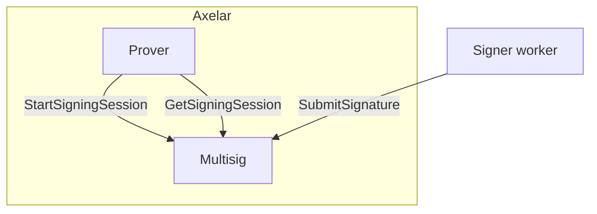
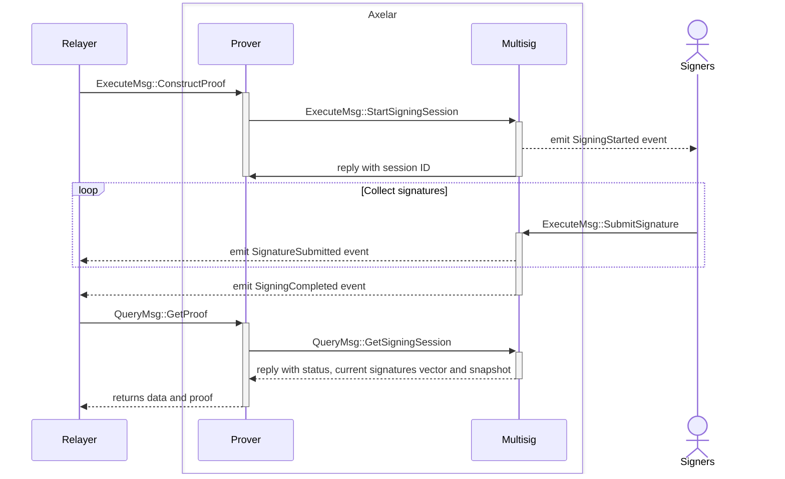

# Multisig contract

This contract is used by the prover contract during proof construction to start a signing session and collect signatures from participants.



- **StartSigningSession**: The multisig contract receives a binary message from the prover contract. It uses the current active set of keys to link to a new signing session and then emits an event to notify signers that a message is pending signature.
- **SubmitSignature**: Each signer will sign the message using their own private key and then submit the signature to the multisig contract. This process validates that the signer is a participant in the snapshot associated with the active key that was set for the multisig session.
- **GetSigningSession**: Query called by the prover contract to retrieve the current state of the session, collected signatures so far and the snapshot with participants information. The proof is generated by the prover contract if the multisig was completed.

<br>

## Signing Sequence Diagram



## Interface

```Rust
pub enum ExecuteMsg {
    StartSigningSession {
        msg: HexBinary,
    },
    SubmitSignature {
        session_id: Uint64,
        signature: HexBinary,
    },
    AuthorizeCaller {
        contract_address: Addr,
    },
    UnauthorizeCaller {
        contract_address: Addr,
    },
}

#[derive(QueryResponses)]
pub enum QueryMsg {
    #[returns(GetSigningSessionResponse)]
    GetSigningSession { session_id: Uint64 },
}

pub struct GetSigningSessionResponse {
    state: MultisigState,
    signatures: HashMap<String, HexBinary>,
    snapshot: Snapshot,
}

pub enum MultisigState {
    Pending,
    Completed,
}
```

## Events

```Rust
pub enum Event {
    // Emitted when a new signing session is open
    SigningStarted {
        session_id: Uint64,
        key_id: Uint64,
        pub_keys: HashMap<String, HexBinary>,
        msg: HexBinary,
    },
    // Emitted when a participants submits a signature
    SignatureSubmitted {
        session_id: Uint64,
        participant: Addr,
        signature: HexBinary,
    },
    // Emitted when a signing session was completed
    SigningCompleted {
        session_id: Uint64,
    },
    // Emitted when a StartSigningSession caller is authorized
    CallerAuthorized {
        contract_address: Addr,
    },
    // Emitted when a StartSigningSession caller is unauthorized
    CallerUnauthorized {
        contract_address: Addr,
    },
}
```
