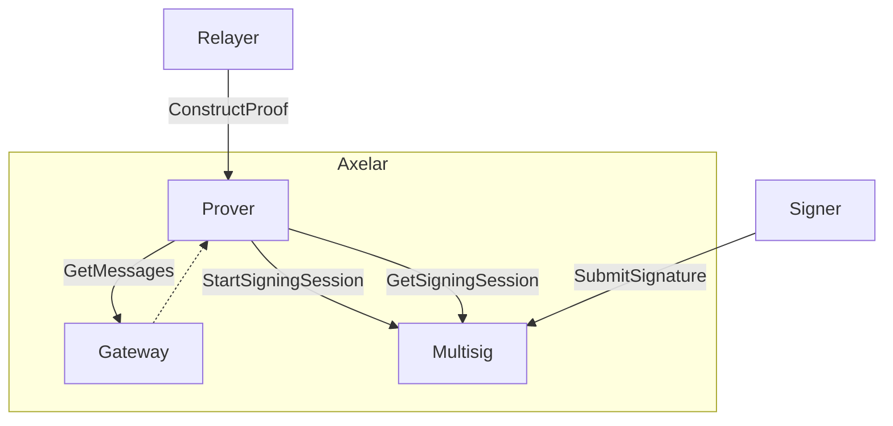
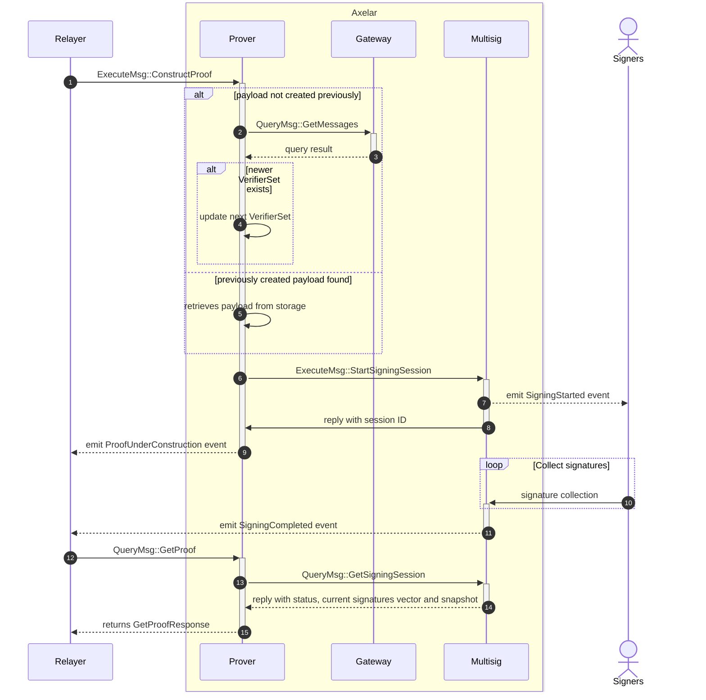
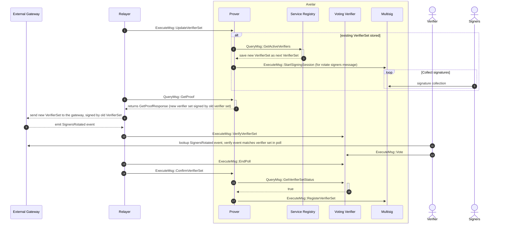

# Multisig prover contract

The prover contract is responsible for transforming gateway messages into a payload that is ready to be sent to
the destination gateway. It calls the multisig contract to generate the signature proof and finally encodes both the
data and proof so that relayers can take it and send it to the destination chain gateway.

## Interface

```Rust
pub enum ExecuteMsg {
    // Start building a proof that includes specified messages
    // Queries the gateway for actual message contents
    ConstructProof {
        message_ids: Vec<String>,
    },
    UpdateVerifierSet,
    ConfirmVerifierSet,
    // Updates the signing threshold. The threshold currently in use does not change.
    // The verifier set must be updated and confirmed for the change to take effect.
    // Callable only by governance.
    UpdateSigningThreshold {
        new_signing_threshold: MajorityThreshold,
    },
    UpdateAdmin {
        new_admin_address: String,
    },
}

#[derive(QueryResponses)]
pub enum QueryMsg {
    #[returns(GetProofResponse)]
    GetProof { multisig_session_id: Uint64 },

    #[returns(Option<multisig::verifier_set::VerifierSet>)]
    GetVerifierSet,
}

pub enum ProofStatus {
    Pending,
    Completed { execute_data: HexBinary }, // encoded data and proof sent to destination gateway
}

pub struct GetProofResponse {
    pub multisig_session_id: Uint64,
    pub message_ids: Vec<String>,
    pub data: Data,
    pub status: ProofStatus,
}
```

## Events

```Rust
pub enum Event {
    ProofUnderConstruction {
        payload_id: PayloadId,
        multisig_session_id: Uint64,
    },
}
```

<br>

## Proof construction graph



## Proof construction sequence diagram



1. Relayer asks Prover contract to construct proof providing a list of messages IDs
2. If no payload for the given messages was previously created, it queries the gateway for the messages to construct it
3. With the retrieved messages, the Prover contract transforms them into a payload digest that needs to be signed by the multisig.
4. If previous payload was found for the given messages IDs, the Prover retrieves it from storage instead of querying the gateway and build it again.
5. The Multisig contract is called asking to sign the payload digest
6. Multisig emits event `SigningStarted` indicating a new multisig session has started
7. Multisig triggers a reply in Prover returning the newly created session ID which is then stored with the payload for reference
8. Prover contract emits event `ProofUnderConstruction` which includes the ID of the proof being constructed.
9. Signers submit their signatures until threshold is reached
10. Multisig emits event indicating the multisig session has been completed
11. Relayer queries Prover for the proof, using the proof ID
12. Prover queries Multisig for the multisig session, using the session ID
13. Multisig replies with the multisig state, the list of collected signatures so far and the snapshot of participants.
14. If the Multisig state is `Completed`, the Prover finalizes constructing the proof and returns the `GetProofResponse`
    struct which includes the proof itself and the data to be sent to the destination gateway. If the state is not
    completed, the Prover returns the `GetProofResponse` struct with the `status` field set to `Pending`.

## Update and confirm VerifierSet graph


## Update and confirm VerifierSet sequence diagram



1. The Relayer calls Prover to update the `VerifierSet`.
2. The Prover calls Service Registry to get a `VerifierSet`
3. If a newer `VerifierSet` was found, the new `VerifierSet` is stored as the next `VerifierSet`. The prover creates payload for the new verifier set.
4. The Multisig contract is called asking to sign the binary message
5. Signers submit their signatures until threshold is reached
6. Relayer queries Prover for the proof, using the proof ID
7. If the Multisig state is `Completed`, the Prover finalizes constructing the proof and returns the `GetProofResponse`
   struct which includes the proof itself and the data to be sent to the External Chain's gateway. If the state is not
   completed, the Prover returns the `GetProofResponse` struct with the `status` field set to `Pending`.
8. Relayer sends proof and data to the External Gateway.
9. The gateway on the External Gateway processes the commands in the data and emits event `SingersRotated`.
10. The event `SingersRotated` picked up by the Relayer, the Relayer calls Voting Verifier to create a poll.
11. The Verifiers see the `PollStarted` event and lookup `SingersRotated`` event on the External Gateway and
    verify event matches verifier set in poll.
12. The Verifiers then vote on whether the event matches the verifiers or not.
13. The Relayer calls the Voting Verifier to end the poll and emit `PollEnded` event.
14. Once the poll is completed, the Relayer calls the Prover to confirm if the `VerifierSet` was updated.
15. The Prover queries the Voting Verifier to check if the `VerifierSet` is confirmed.
16. The Voting Verifier returns that the `VerifierSet` is confirmed.
17. The Prover stores the `VerifierSet` in itself and in Multisig.
