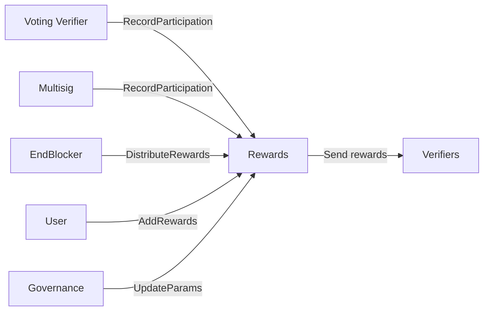
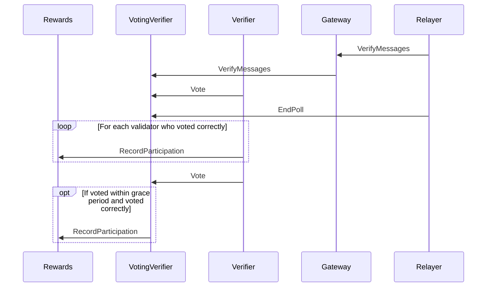
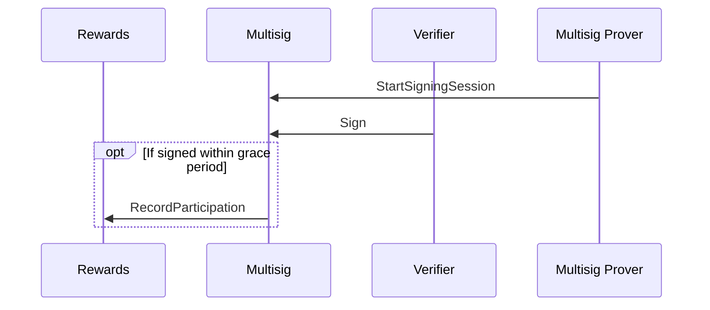

## Rewards

The rewards contract is responsible for tracking verifier participation in voting and signing.
The voting verifier and multisig contract send messages to the rewards contract when verifiers
participate in events. The rewards contract keeps a tally of how many events each verifier
participated in. Participation is assessed per epoch, which is a length of time configurable
by governance. Calling `DistributeRewards` distributes rewards for the epoch two epochs prior to the current epoch,
(so if we are in epoch 2, we distribute rewards for epoch 0). Rewards are split equally amongst
all participating validators in the epoch. The rewards rate (number of tokens distributed per epoch)
is configurable by governance. Anyone can add funds to the rewards pool by calling `AddRewards`.
Anyone can call `DistributeRewards` and trigger rewards distribution, but it is designed to be called
automatically by the end blocker.

### Voting Flow

### Signing Flow

