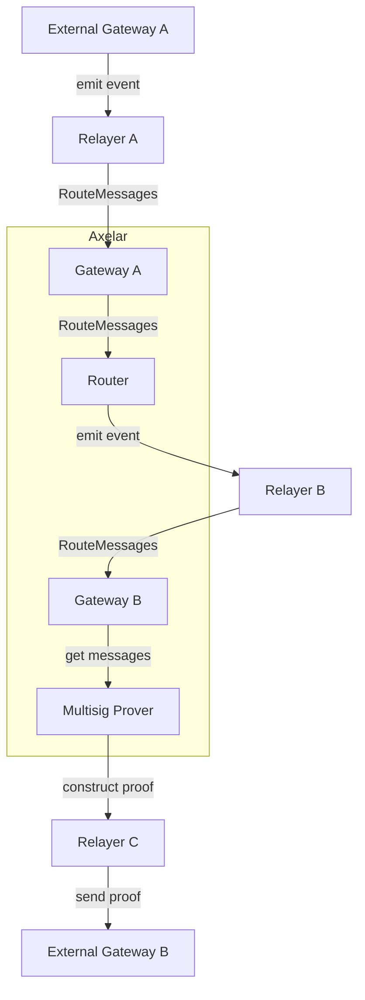
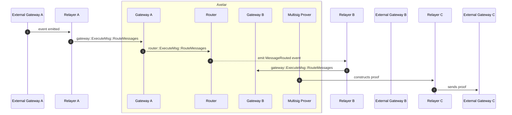

# Router Contract

The router contract is responsible for routing messages to and from registered gateways, as well as handling chain
registration, gateway upgrades and chain freezing.
<br>
The router admin can freeze and unfreeze a chain for a specified direction, while governance can register a chain and
upgrade its gateway.

## Interface

```Rust
pub enum ExecuteMsg {
    // Registers a new chain with the router
    // can only be called by governance or coordinator contract
    RegisterChain {
        chain: ChainName,
        gateway_address: Address,
        msg_id_format: MessageIdFormat,
    },

    // Changes the gateway address associated with a particular chain
    // can only be called by governance
    UpgradeGateway {
        chain: ChainName,
        contract_address: Address,
    },

    /*
     * Router Admin or Governance Methods
     * All of the below messages can only be called by the router admin or governance
     */
    /// Freezes the specified chains in the specified directions
    FreezeChains {
        chains: HashMap<ChainName, GatewayDirection>
    },
    /// Unfreezes the specified chains in the specified directions
    UnfreezeChains {
        chains: HashMap<ChainName, GatewayDirection>
    },
     /// Emergency command to stop all amplifier routing.
    DisableRouting,
    /// Resumes routing after an emergency shutdown.
    EnableRouting,

    /*
     * Gateway Messages
     * The below message can only be called by registered gateways
     */
    // Routes each message to the gateway registered to the destination chain.
    // Called by a registered gateway
    RouteMessages(Vec<Message>),
}

pub struct RouterInstantiated {
    pub admin: Addr,
    pub governance: Addr,
    pub axelarnet_gateway: Addr,
    pub coordinator: Addr,
}

pub struct ChainRegistered {
    pub name: ChainName,
    pub gateway: Addr,
}

pub struct GatewayInfo {
    pub chain: ChainName,
    pub gateway_address: Addr,
}

pub struct GatewayUpgraded {
    pub gateway: GatewayInfo,
}

pub struct RoutingDisabled;

pub struct RoutingEnabled;

pub struct ChainFrozen {
    pub name: ChainName,
    pub direction: GatewayDirection,
}

pub struct ChainUnfrozen {
    pub name: ChainName,
    pub direction: GatewayDirection,
}

pub struct MessageRouted {
    pub msg: Message,
}
```

## Router graph



## Message Routing sequence diagram



1. The External Gateway emits an event that is picked up by the Relayer.
2. Relayer relays the event to the Gateway as a message.
3. Gateway receives the incoming messages, verifies the messages, and then passes the messages to the Router.
4. The Router emits a `MessageRouted` event, which is picked up by Relayer B. The relayer then calls `RouteMessages` on Gateway B to forward the message.
5. The Multisig Prover takes the messages stored in the destination Gateway and constructs a proof.
6. The Relayer sends the proof, which also contains messages, to the destination's External Gateway.

### Notes

1. External Gateways are deployed on blockchains other than Axelar, such as Ethereum and Avalanche, while internal
   gateways reside on Axelar's chain.
