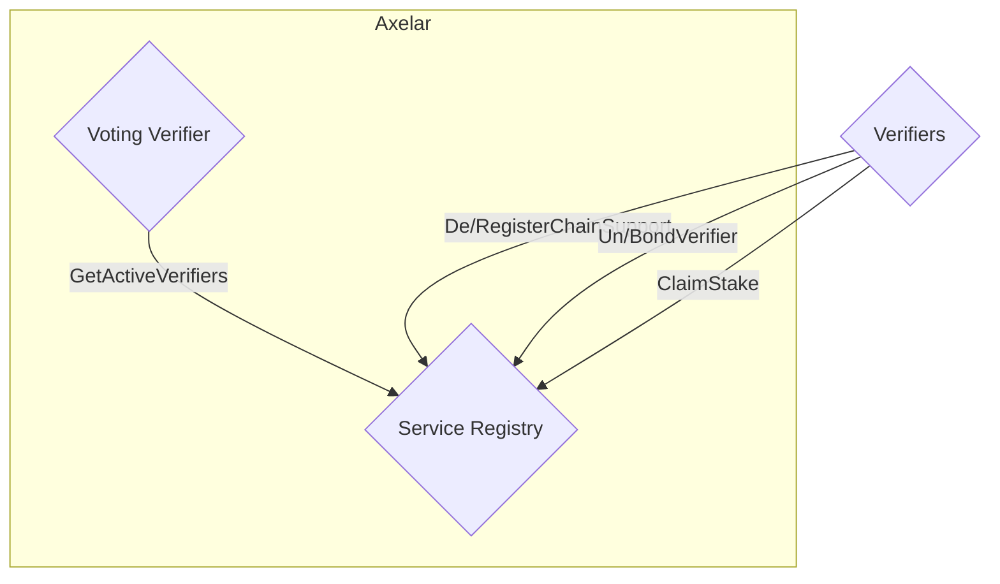
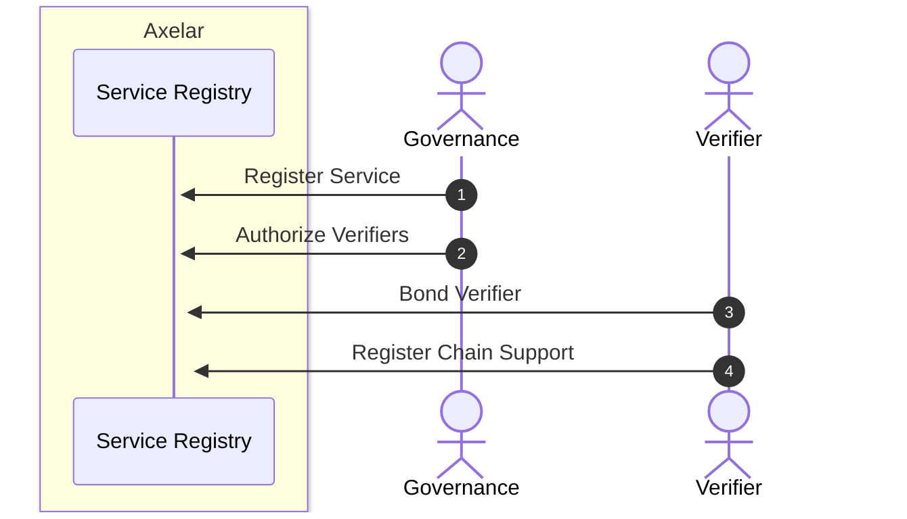

# Service Registry

The service registry keeps track of the pool of verifiers that vote and sign for each chain.
The core functionalities, such as registering a new service, verifier authorization and un-authorization can only be
called
from a governance address. Verifier bonding and unbonding, as well as registering support for specific chains, are
called
by the verifier themselves.
To become active and be eligible to participate in voting for a specific chain,
each verifier should first be authorized and bond enough stake, and then register support for that chain.
Service registry is used by ampd, verifier, and multisig prover.

The term `service` refers to an upper-level entity that includes several
`chains`. The difference is in how they are related to each other, which is
hierarchical; a service is like an umbrella that regulates the activities of
several chains that fall under its purview. The service defines common
parameters, such as verifier requirements, bonding details, and unbonding periods, which are applicable to all
associated
chains.
Thus, we use a single instance of service registry to organize and coordinate activities across all chains.

## Interface

```Rust
pub enum ExecuteMsg {
    // Can only be called by governance account
    RegisterService {
        service_name: String,
        coordinator_contract: Addr,
        min_num_verifiers: u16,
        max_num_verifiers: Option<u16>,
        min_verifier_bond: Uint128,
        bond_denom: String,
        unbonding_period_days: u16,
        description: String,
    },
    // Authorizes verifiers to join a service. Can only be called by governance account. Verifiers must still bond sufficient stake to participate.
    AuthorizeVerifiers {
        verifiers: Vec<String>,
        service_name: String,
    },
    // Revoke authorization for specified verifiers. Can only be called by governance account. Verifiers bond remains unchanged
    UnauthorizeVerifiers {
        verifiers: Vec<String>,
        service_name: String,
    },

    // Register support for the specified chains. Called by the verifier.
    RegisterChainSupport {
        service_name: String,
        chains: Vec<ChainName>,
    },
    // Deregister support for the specified chains. Called by the verifier.
    DeregisterChainSupport {
        service_name: String,
        chains: Vec<ChainName>,
    },

    // Locks up any funds sent with the message as stake. Called by the verifier.
    BondVerifier {
        service_name: String,
    },
    // Initiates unbonding of staked funds. Called by the verifier.
    UnbondVerifier {
        service_name: String,
    },
    // Claim previously staked funds that have finished unbonding. Called by the verifier.
    ClaimStake {
        service_name: String,
    },
}

```

## Service Registry graph



## Service Registry sequence diagram



1. The Governance registers a new service by providing the necessary parameters for the service.
2. Governance is also responsible for authorizing verifiers to join the service by sending an `Authorize Verifiers`
   message.
3. Verifiers bond to the service, providing stake, by sending a `Bond Verifier` message with appropriate funds included.
   Note that authorizing and bonding can be done in any order.
4. Verifiers register support for specific chains within the service by specifying service name and chain names.

### Notes

1. For the process of signing, verifiers need to register their public key in advance to be able to participate,
   the details of which are available in [`multisig documentation`](multisig.md).
