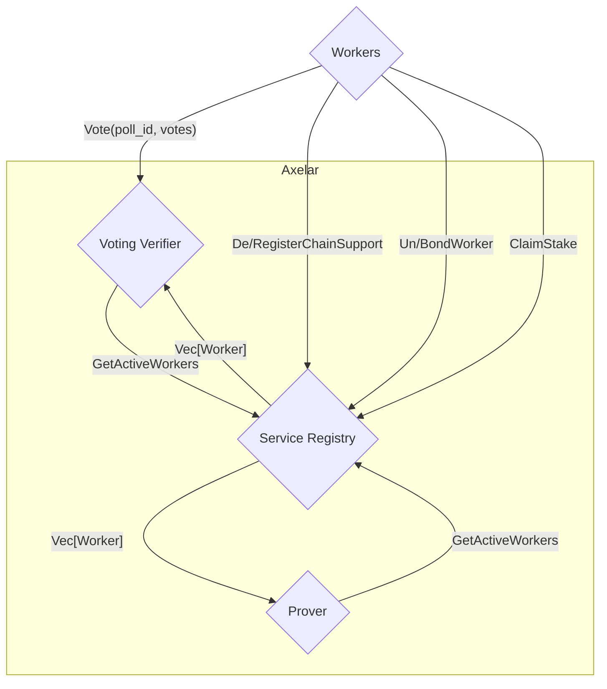
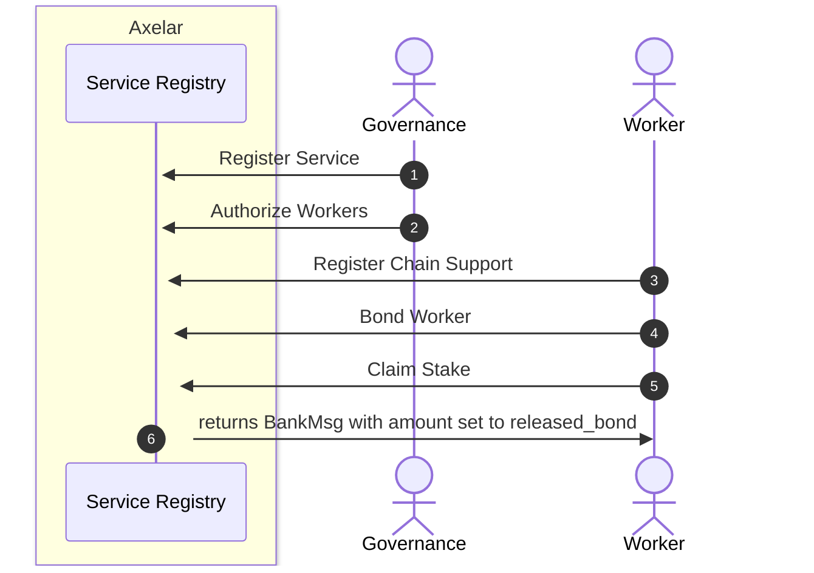

# Service Registry

The service registry keeps track of the pool of workers that are related to each service.
The core functionalities, such as registering a new service, worker authorization and un-authorization can only be called 
from a governance address. To become active and be eligible to participate in voting for a specific service, 
each worker should first be authorized and the bond enough stake. Service registry is used by ampd, verifier, and multisig prover.


## Interface

```Rust
pub enum ExecuteMsg {
    // Can only be called by governance account
    RegisterService {
        service_name: String,
        service_contract: Addr,
        min_num_workers: u16,
        max_num_workers: Option<u16>,
        min_worker_bond: Uint128,
        bond_denom: String,
        unbonding_period_days: u16,
        description: String,
    },
    // Authorizes workers to join a service. Can only be called by governance account. Workers must still bond sufficient stake to participate.
    AuthorizeWorkers {
        workers: Vec<String>,
        service_name: String,
    },
    // Revoke authorization for specified workers. Can only be called by governance account. Workers bond remains unchanged
    UnauthorizeWorkers {
        workers: Vec<String>,
        service_name: String,
    },

    // Register support for the specified chains. Called by the worker.
    RegisterChainSupport {
        service_name: String,
        chains: Vec<ChainName>,
    },
    // Deregister support for the specified chains. Called by the worker.
    DeregisterChainSupport {
        service_name: String,
        chains: Vec<ChainName>,
    },

    // Locks up any funds sent with the message as stake. Called by the worker.
    BondWorker {
        service_name: String,
    },
    // Initiates unbonding of staked funds. Called by the worker.
    UnbondWorker {
        service_name: String,
    },
    // Claim previously staked funds that have finished unbonding. Called by the worker.
    ClaimStake {
        service_name: String,
    },
}

```

## Service Registry graph



## Service Registry sequence diagram



1. The Governance registers a new service by providing the necessary parameters for the service.
2. Governance is also responsible for authorizing workers to join the service by sending an `Authorize Workers` message.
3. Workers register support for specific chains within the service by specifying service name and chain names.
4. Workers bond to the service, providing stake, by sending a `Bond Worker` message with appropriate funds denominator.
5. Workers can claim released stake with `Claim Stake` message, and the Service Registry responds with a BankMsg containing the released bond.


