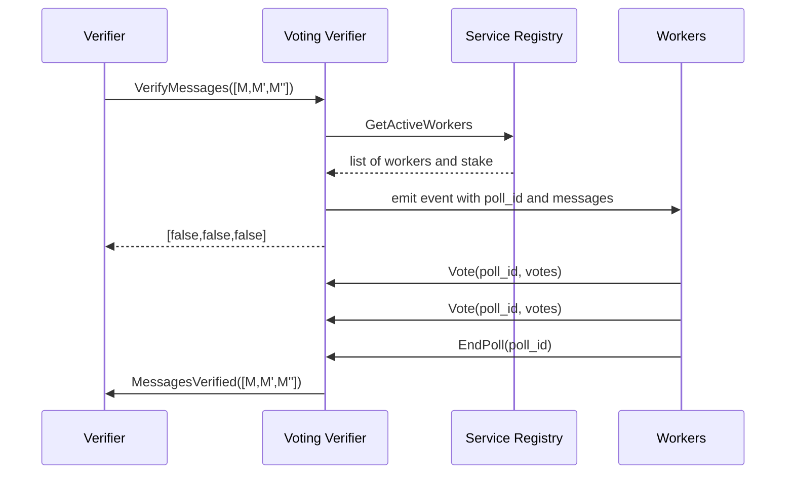

# Voting Verifier

The voting verifier verifies batches of messages via RPC voting. Polls are created and votes are cast via a generic voting module,
which the voting verifier uses. The generic voting module does not know the meaning of the polls, and simply returns a poll
poll ID to the voting verifier. The voting verifier internally maps
a poll ID to the messages in the poll, to be able to call back to
the verifier and propagate the result back to the gateway.


## Verfier graph


## Code & Entity Structure
To better understand the entities and functionalities, we suggest the following order to read the `voting-verifier` contract code:

1. **[state.rs](https://github.com/axelarnetwork/axelar-amplifier/blob/main/contracts/voting-verifier/src/state.rs)**
2. **[msg.rs](https://github.com/axelarnetwork/axelar-amplifier/blob/main/contracts/voting-verifier/src/msg.rs)**
3. **[query.rs](https://github.com/axelarnetwork/axelar-amplifier/blob/main/contracts/voting-verifier/src/query.rs)**
4. **[execute.rs](https://github.com/axelarnetwork/axelar-amplifier/blob/main/contracts/voting-verifier/src/execute.rs)**
5. **[contracts.rs](https://github.com/axelarnetwork/axelar-amplifier/blob/main/contracts/voting-verifier/src/contract.rs)**

There are two types of `Poll`: 

1. The first one is defined in `state.rs`:
    ```Rust
    pub enum Poll {
        Messages(WeightedPoll),
        ConfirmWorkerSet(WeightedPoll),
    }
    ```
    When dealing with gateways deployed on external chains, 
    there is a requirement to inform them about the workers from whom they can accept signatures. While the `service-registry` 
    manages this process for the Axelar chain, an alternative mechanism is needed for external chains.
    
    The internal `Poll` enum handles this need. It is employed whenever there is a necessity to update the set of workers—whether it involves adding a 
    new worker or removing an existing one. In such cases, a message is generated, and this message must be relayed to the external gateway. It is also 
    important to confirm that the external chain has received the message to finalize the process.


2. The second one resides in `msg.rs`:
    ```Rust
   pub struct Poll {
        poll_id: PollId,
        messages: Vec<Message>,
    }
   ```


## Message Verification Sequence Diagram



