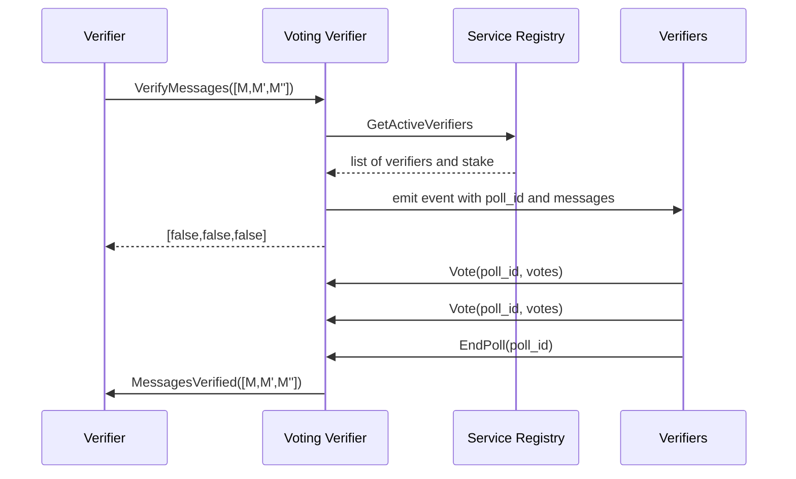

# Voting Verifier

The voting verifier verifies batches of messages via RPC voting. Polls are created and votes are cast via a generic
voting module,
which the voting verifier uses. The generic voting module does not know the meaning of the Polls, and simply returns a
Poll ID to the voting verifier. The voting verifier internally maps
a Poll ID to the messages in the Poll, to be able to call back to
the verifier and propagate the result back to the gateway.

There are two types of polls: messages polls and verifier set polls. Messages polls are used to verify incoming
messages,
while verifier set polls are used to verify that the external gateway has updated it's stored verifier set. Verifier set
polls
are a necessary component of the verifier set update flow.
See [`update and confirm VerifierSet sequence diagram`](multisig_prover.md)
for more details.

## Verifier graph

## Message Verification Sequence Diagram

