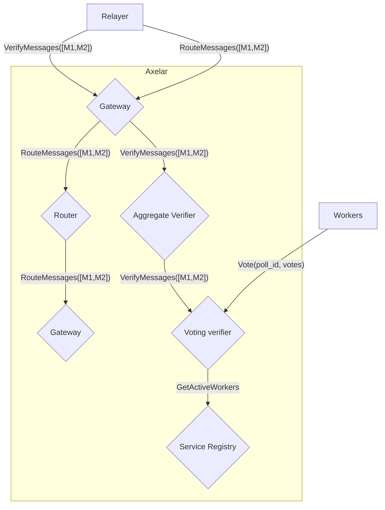

# Contributing to documentation

Amplifier documentation uses the tool [mdbook](https://rust-lang.github.io/mdBook/) to generate this book from `.md` files. Documentation files can be found under the `doc` directory in the [project root](https://github.com/axelarnetwork/axelar-amplifier)

## Reference code snippets with ANCHOR

Use `ANCHOR: <name>` and `ANCHOR_END: <name>` to label code snippets in rust files. Make sure to not use triple slashes `///` for anchors in the code snippets or they will be interpreted as part of the struct documentation

```rust
// ANCHOR: events

pub struct MyEvent {
  pub field: u32
}

// ANCHOR_END: events
```

Then reference the code snippet in the book with `\{{#include <path>:<anchor_name>}}`

```rust,no_run,no_playground
\{{#include ../contracts/multisig/src/events.rs:events}}
```

See [Including portions of a file](https://rust-lang.github.io/mdBook/format/mdbook.html?highlight=include#including-portions-of-a-file) for more info

Note: [Include directives to missing files do not return error](https://github.com/rust-lang/mdBook/issues/1094)

## Mermaid diagram

Mermaid diagrams can be rendered in the book automatically thanks to the configured preprocessor `mdbook-mermaid`


