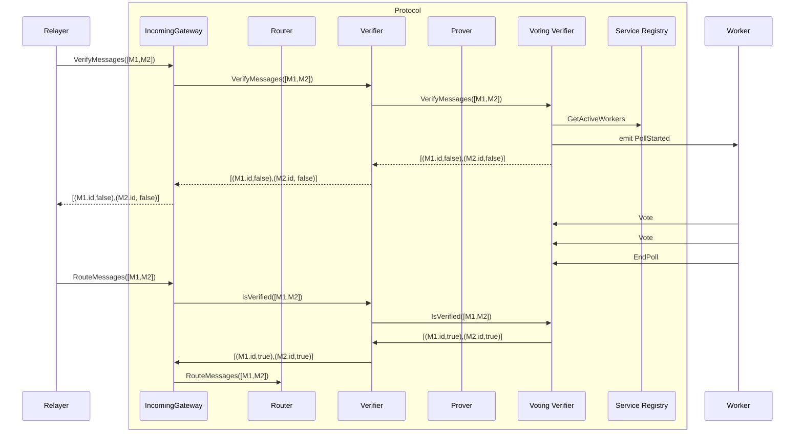

# Message Semantics

Structure of a routing packet (`M` in the diagrams)

```rust
    struct Message {
        cc_id: CrossChainId,
        source_address: Address, // String
        destination_chain: ChainName, // String
        destination_address: Address,
        payload_hash: [u8; 32]
    }

    // Combination of chain name and a unique identifier
    pub struct CrossChainId { 
        pub chain: ChainName,
        pub id: nonempty::String,
    }
```

# High Level Architecture

Incoming Flow:


Outgoing Flow:


# Event Flow

In the below diagram, the blue box represents the protocol. All messages flowing into, out of or within the blue box
are part of the protocol. All components within the blue box are on chain. All components outside of the blue box are off chain.

## Voting Contract Flows

Incoming Message Flow



Outgoing Message Flow


Prover stores the snapshot of the current signers and passes the snapshot to the multisig contract.
Periodically, the stored snapshot is rotated by the prover controller, which triggers the prover to
query the service registry for an updated snapshot.

## Contract Overview

### Connection Router

[`connection-router`](./contracts/connection_router.md) is the way messages are passed between different gateways. The router has methods for registering new chains and gateways, updating the address of the registered gateway, and freezing chains (preventing message flow). These methods are only callable by the router admin. Messages are passed to the router from registered gateways, and the router passes those messages to the appropriate gateway based on each message's destination chain.

### Gateway

[`gateway`](./contracts/gateway.md) is the entry point for incoming messages. Each gateway corresponds to a single connected external chain. Messages are passed to the gateway in a permissionless manner. For each message passed to the gateway, the gateway checks whether the message has been verified by calling into a linked verifier contract. For each verified message, the gateway passes the message to the router.

The gateway also accepts messages from the router. These are messages sent from other chains. The gateway trusts that any message being sent from the router was originally sent from the correct source gateway, and verified appropriately by the source verifier. The gateway stores these received messages, which can be later added to a proof, to be relayed to an external chain.

### Verifier

The verifier contracts are responsible for verifying whether a given message or batch of messages has occurred on a connected external chain. The verifier can take many different forms, such as a [`voting-verifier`](./contracts/voting_verifier.md) that conducts stake weighted polls for batches of messages, a light client that accepts block headers and merkle tree proofs, a zk proof verifier, etc. The verifier can also be an [`aggregate-verifier`](./contracts/aggregate_verifier.md), that is linked to 1 or more other verifiers, and defines a security policy such as 2 out of 3 linked verification methods need to report a message as verified.

### Prover

The prover contract is responsible for constructing proofs of routed messages, to be passed to external chains. The most common example of this is the [`multisig-prover`](./contracts/multisig_prover.md) that constructs signed batches of routed messages, which are then relayed (permissionlessly) to an external chain. In this example, the prover fetches the messages from the gateway, and interacts with the multisig contract to conduct the signing.

### Multisig Contract

[`multisig`](./contracts/multisig.md) is responsible for signing arbitrary blobs of data. Contracts register with the multisig contract to generate a key id, and then use that key id to initiate signing sessions. Off chain workers associated with the key id sign messages when new signing sessions are created.

### Service Registry

[`service-registry`](./contracts/service_registry.md) is responsible for tracking workers associated with specific services. Two example services are voting and sigining. Workers must be authorized to join a service via governance vote. Once authorized, workers must also bond a sufficient amount of stake before becoming active in the service. Services query the service registry to create weighted snapshots of the active worker set.
